# 运行时网络隔离、DNS 与事务化 sing-box 设计

> 日期：2026-07-28
>
> 状态：待评审
>
> 适用范围：单 WAN/单 LAN 为主、可外接中继路由器或交换机的 x86 OpenWrt 跨境播软路由
>
> 核心结论：管理面使用不占物理 LAN 的 `wg-mgmt`；基础网络不依赖 sing-box；业务面采用单 sing-box；配置通过候选生成、验证、原子切换和健康回滚生效；业务失败时 fail-closed，管理面继续可达。

## 1. 事故结论与调研复核

本设计以 `docs/postmortem-2026-07-23-dns-disaster.md` 为强制约束，并复核了 `docs/research-dns-architecture.md` 与 sing-box 1.11.5 官方配置文档。

### 1.1 已确认结论

1. `dns.servers[].detour` 控制 sing-box 连接该 DNS 服务器时使用的出站。
2. `local-dns` 是基础解析通道，必须保持 `direct`，不能依赖待启动的 VLESS 链路。
3. 全局目的端口 53 规则会同时匹配路由器自身或 sing-box 自身流量，不能用于客户端 DNS 防泄漏。
4. sing-box 1.11.5 支持旧格式 FakeIP：`dns.fakeip` 与 `address: "fakeip"`。
5. sing-box 1.11.5 支持显式路由动作 `action: "hijack-dns"`，它才表示把匹配的 DNS 请求送入 sing-box DNS 模块。
6. TUN 的 `auto_route` 负责设置路由，不等价于“客户端 DNS 自动进入 sing-box DNS 模块”。
7. 远程 rule-set 在启动时可能下载；如果下载依赖代理链路，就仍可能形成启动依赖。

### 1.2 对调研文档需要修正或补证的部分

| 原调研表述 | 复核结论 | 设计处理 |
|---|---|---|
| “TUN 默认劫持客户端 DNS 到 DNS 模块” | 对 1.11.5 不能这样概括；需要显式 `hijack-dns`，而发往路由器本机 dnsmasq 的流量还可能先走内核 local 路径 | 使用独立 TUN DNS 地址、生产入口定向捕获、显式 `hijack-dns` |
| 当前 Mac DNS 完整经过 sing-box DNS 模块 | 当前生成配置没有 `hijack-dns`，项目也没有保存证明该路径的抓包证据 | 上线前以 nft trace、tcpdump 和 sing-box 日志验证，不把推测当现状 |
| FakeIP 架构“没有循环依赖” | FakeIP 本身不需要外部解析，但远程规则集、节点域名和非 A/AAAA 查询仍可能有依赖 | rule-set 随应用包本地化；节点优先使用 IP；保留独立 direct bootstrap DNS |
| `reverse_mapping` 等价于 FakeIP 映射 | 二者用途相关但不是同一机制；reverse mapping 依赖应用先解析真实地址 | 代理域名直接使用 FakeIP，不以 reverse mapping 代替 |
| `proxy-dns` 从国内直连可达且可避免污染 | 可达性和结果可信度都不能保证 | 国外 A/AAAA 不直连查询，返回 FakeIP；其他查询按业务链路处理 |

因此，调研对“DNS 需要在路由决策之前避免真实外查、FakeIP 优于事后 sniff 补救”的方向是正确的；但对当前实际数据路径的描述证据不足，不能原样当作生产架构。

## 2. 设计目标

1. sing-box 崩溃、配置错误或链路不可用时，总部仍能 SSH、打开管理页面和执行回滚。
2. 管理逻辑网络不占用 LAN 物理口，也不要求现场交换机支持 VLAN。
3. 一个物理 LAN 口可以按现场设备能力支持一组或多组业务终端。
4. 客户端业务流量不得在代理失败时偷偷从 WAN 直出。
5. 国内域名和地址可以按策略直连；国外代理域名不在国内发出真实 A/AAAA 查询。
6. 路由器自身启动、时间同步、WireGuard、升级和规则加载不依赖 sing-box 业务链路。
7. 配置修改必须是事务：全部验证成功才生效，失败恢复上一已知良好版本。
8. LuCI 展示必须区分“用户想要的配置”和“设备实际运行的配置”，不产生幽灵数据。

## 3. 五个平面

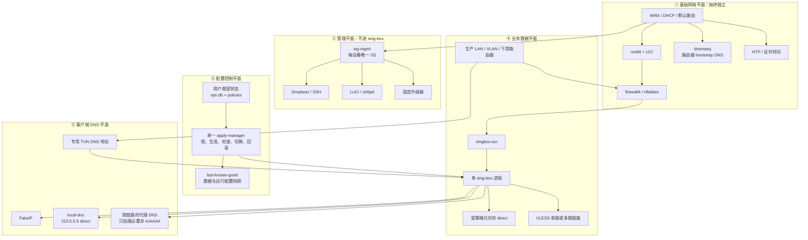

核心依赖方向是：

```text
基础网络 → 管理面
基础网络 → sing-box
配置控制面 → sing-box

禁止：
管理面 → 依赖 sing-box 才能工作
基础 DNS → 依赖 VLESS 链路才能启动
升级器 → 通过业务 TUN 才能访问 GitHub
```

## 4. 管理网络：不用管理 VLAN，不占 LAN 口

### 4.1 推荐拓扑

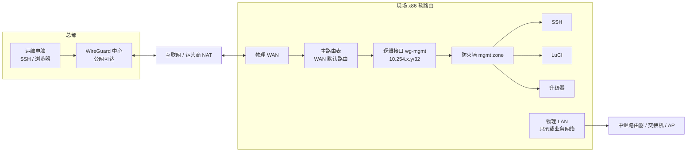

`wg-mgmt` 是三层逻辑管理接口，不是 `eth1.<vlan>`，因此：

- 不消耗 LAN 物理端口；
- 不要求现场交换机支持 VLAN；
- 不和业务广播域混在一起；
- 设备在 NAT 后也能主动连接总部；
- 总部使用固定管理 IP，不依赖现场 WAN 地址变化。

### 4.2 路由隔离

管理隧道必须明确绕开 sing-box：

1. WireGuard 公网 endpoint 的主机路由固定走 WAN 网关；
2. `wg-mgmt` 使用独立路由规则/表，优先级高于 sing-box TUN 规则；
3. sing-box TUN 明确排除 `wg-mgmt`、WireGuard endpoint 和管理地址段；
4. 升级器绑定 WAN 或管理表访问 GitHub Release；
5. firewall4 禁止生产 LAN 进入 `mgmt` zone；
6. SSH、LuCI 只监听 `wg-mgmt` 地址，WAN 和生产 LAN 默认不监听。

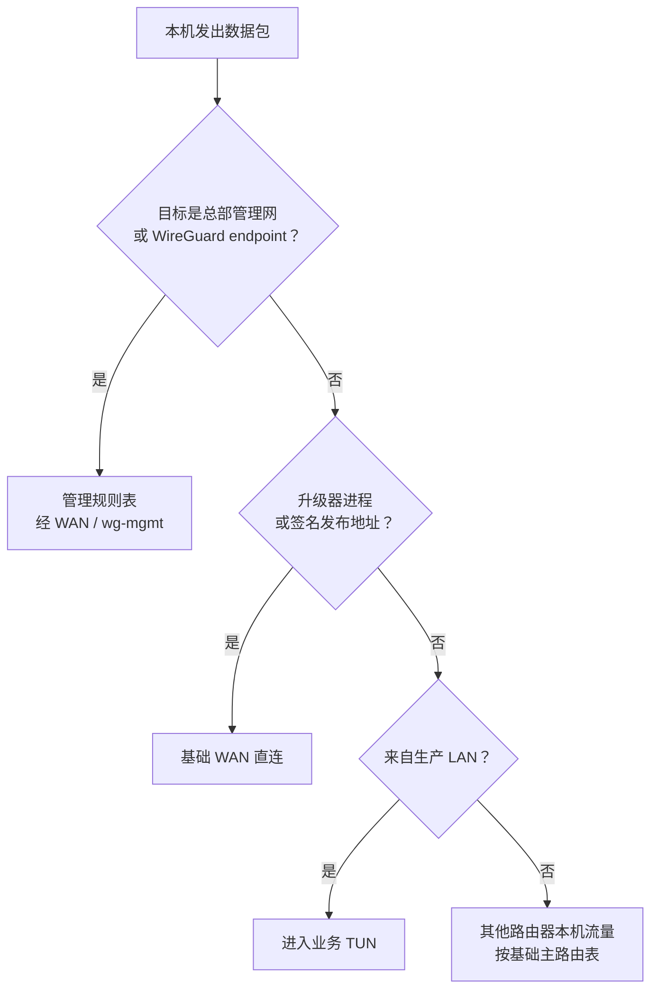

### 4.3 防火墙 zone

| Zone | 接口 | input | output | forward | 用途 |
|---|---|---:|---:|---:|---|
| `wan` | 物理 WAN | REJECT | ACCEPT | REJECT | 基础互联网 |
| `mgmt` | `wg-mgmt` | 仅总部允许 | ACCEPT | 默认 REJECT | SSH、LuCI、升级 |
| `prod` | 业务 LAN/VLAN | 仅 DHCP、必要 ICMP；DNS 先 scoped DNAT | ACCEPT | 默认 REJECT | 终端接入 |
| `tun` | `singbox-tun` | REJECT | ACCEPT | 受控 | sing-box 业务数据 |

特别规则：

- 不建立通用 `prod -> wan` forwarding；
- 只允许生产流量进入 sing-box 捕获路径；
- 生产入口的 TCP/UDP 53 在进入本机 dnsmasq 前定向改写到专用 TUN DNS 地址，dnsmasq 只承担 DHCP 和路由器 bootstrap 解析；
- 允许 sing-box 自身按配置访问 WAN/VLESS；
- `mgmt` 不转发到 `prod`，总部若要诊断终端必须使用明确、临时、可审计的规则；
- 路由器本机 direct 与生产终端 direct 必须可区分，不能用一个宽泛源地址规则。

## 5. 单物理 LAN 的三种业务接法

管理面始终使用 `wg-mgmt`，以下差别只影响业务终端如何分组。

### 5.1 模式 A：非网管交换机或 AP/中继桥接

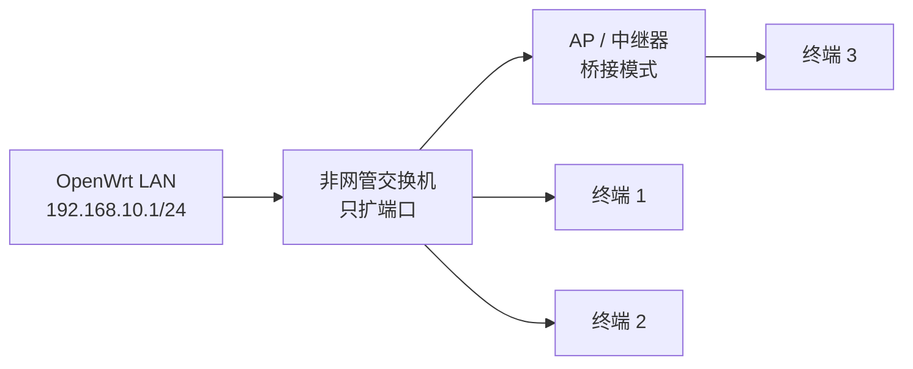

能力：

- 所有终端位于一个二层广播域和一个生产子网；
- 最稳妥的是整个子网绑定一条链路和一份策略；
- 可以用 DHCP 静态租约按源 IP 做细分，但这不是安全隔离，终端改静态 IP 可能冒充另一组；
- 不能仅靠非网管交换机实现多个相互隔离的业务网络。

适用：一个现场只需要一条业务链路，或终端彼此可信。

### 5.2 模式 B：多个下游路由器使用 NAT/路由模式

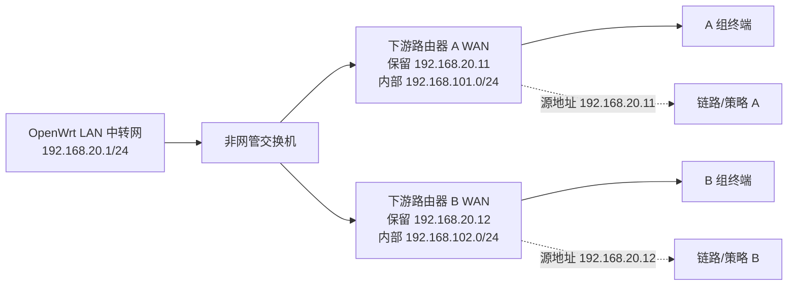

做法：

1. 下游路由器工作在 NAT/路由模式，不是 AP 桥接模式；
2. OpenWrt 根据下游 WAN MAC 分配固定 IP；
3. 数据库把该固定源 IP 绑定到链路；
4. 未登记或 IP/MAC 不一致的设备 fail-closed；
5. 每个下游路由器内部终端被 NAT 聚合成一个可识别源地址。

优点：

- 仍可使用普通非网管交换机；
- 一个物理 LAN 可以承载多组业务和多条链路；
- 分组比按终端 IP 管理简单。

限制：

- 下游路由器之间仍共享 OpenWrt 一侧的二层中转网；
- 隔离主要来自下游 NAT/防火墙，不等同于 VLAN；
- 一个下游路由器内的所有终端默认使用同一链路；
- DHCP 固定租约和数据库绑定必须一致，否则应阻断而不是回落直连。

这是当前“一个 LAN 口 + 普通交换机 + 多组业务”最实用的方案。

### 5.3 模式 C：网管交换机或支持 VLAN 的 AP

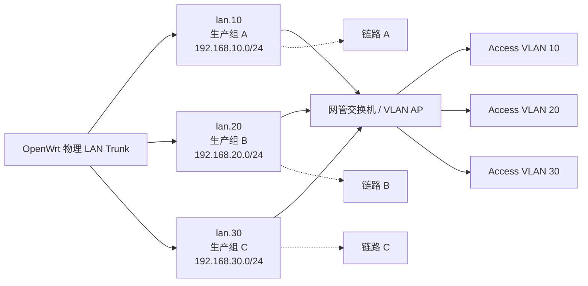

这是隔离能力最强的接法。LAN 口承载多个业务 VLAN，但管理网仍然不放在这些 VLAN 中，依旧走 `wg-mgmt`。

### 5.4 选择表

| 现场设备 | 可支持业务组 | 隔离强度 | 推荐 |
|---|---:|---|---|
| 非网管交换机 + AP 桥接 | 1 个可靠组 | 低 | 单链路场景 |
| 非网管交换机 + 多个 NAT 路由器 | 每个下游路由器 1 组 | 中 | 当前多组业务首选 |
| 网管交换机/VLAN AP | 多 VLAN | 高 | 规模化、强隔离 |

## 6. 业务数据路径

### 6.1 单 sing-box

所有业务组进入一个 sing-box 进程，通过源子网或下游路由器保留 IP 选择链路：

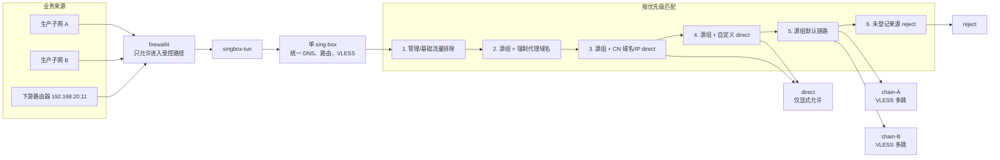

单进程的原因：

- DNS FakeIP 映射、规则集和链路状态只有一份；
- 配置可以整体生成、整体检查和整体回滚；
- 不需要为每个子网维护一套进程、端口、日志和启动顺序；
- 当前业务规模下，进程隔离带来的复杂度大于收益。

若未来实测单进程达到 CPU、内存或文件描述符瓶颈，再按测量结果拆实例；不能为了“看起来隔离”预先复制多个 sing-box。

### 6.2 fail-closed

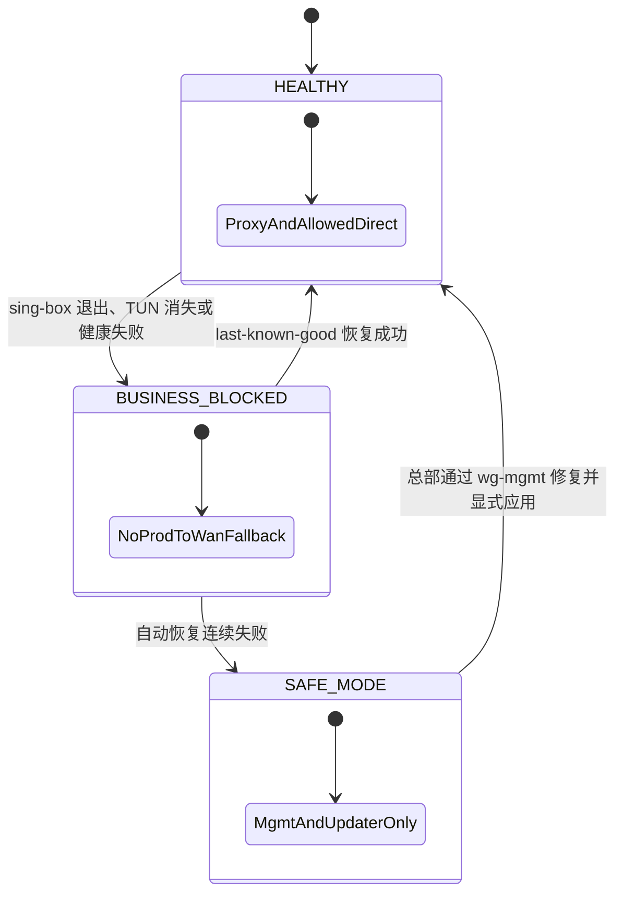

sing-box 失败时：

- 生产终端不能上网，避免流量泄漏；
- `prod -> wan` 没有兜底转发；
- WAN、WireGuard、SSH、LuCI、升级器保持正常；
- apply-manager 尝试恢复 last-known-good；
- 连续失败后进入 safe mode，停止自动反复重启，由总部处理。

这是“业务暂时不可用但数据不泄漏、设备仍可修复”，而不是“为了不断网自动直连”。

## 7. 客户端 DNS 设计

### 7.1 两条完全分离的 DNS 路径

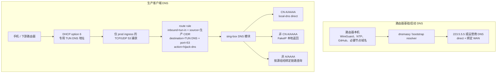

红线：

- 不添加无来源约束的全局 port 53 规则；
- 捕获规则只挂在 `prod` 入方向，并同时限定生产 CIDR、专用 TUN DNS 目的地址和 TCP/UDP 53；
- 路由器 OUTPUT、本地 dnsmasq、`wg-mgmt` 和升级器不进入捕获规则；
- `local-dns` 永远 `detour: direct` 并绑定 WAN；
- sing-box 配置启动不再在线下载 rule-set。

### 7.2 国外域名 FakeIP 流程

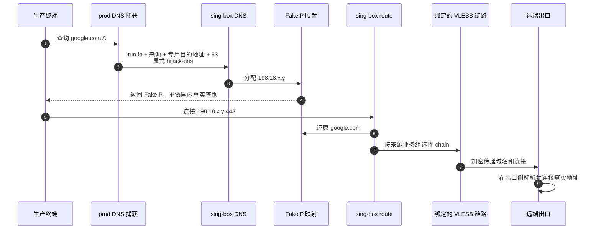

### 7.3 国内域名直连流程

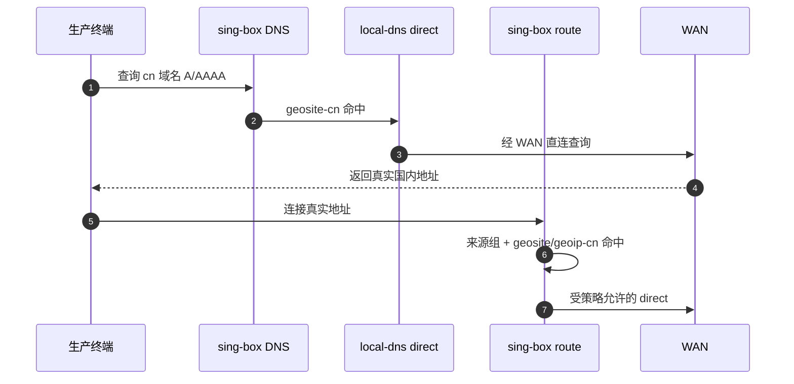

“DNS direct”只表示这次国内解析请求直连，不等于所有后续业务流量直连。最终连接仍需经过来源组路由规则。

### 7.4 客户端绕过处理

客户端手工设置 `8.8.8.8` 时，生产入口捕获把该 TCP/UDP 53 请求送往专用 DNS 路径；DoH/DoT 不属于普通 53 端口：

- 已知 DoH/DoT 域名和 IP 可由策略阻断或强制代理；
- 浏览器内置 DoH 需要终端策略配合，不能仅凭端口 53 完全控制；
- 对 QUIC、ECH 等场景不能只依赖 SNI sniff，FakeIP 映射是主路径；
- 不能承诺在未知加密 DNS 服务不断变化时仅靠路由器规则做到永久、百分之百识别。

## 8. 本地规则集与启动依赖

当前远程 rule-set 可能在 sing-box 启动时访问 CDN。新架构把生产规则集作为应用 Release 的签名内容随包下发：

```text
/run/tiktokproxy/current/rules/
  geosite-cn.srs
  geoip-cn.srs
  policy-*.srs
```

应用 OTA 在切换前完成：

1. 下载发布包；
2. 验证签名和哈希；
3. 校验所有本地 rule-set；
4. 生成候选 sing-box 配置；
5. 执行目标版本 `sing-box check`；
6. 原子切换应用和规则目录；
7. 重启并健康检查；
8. 失败恢复旧应用、旧规则和旧配置。

运行时 sing-box 不把“首次下载远程规则集成功”作为启动前提。规则更新走统一应用发布流程，不在每台设备上自行漂移。

## 9. 事务化配置应用

### 9.1 数据状态

| 状态 | 含义 | LuCI 展示 |
|---|---|---|
| `desired_generation` | 用户最近一次保存的期望配置版本 | “待应用”或“应用中” |
| `applied_generation` | 当前 sing-box 实际运行且健康的版本 | “运行中” |
| `last_good_generation` | 最近一次可恢复的健康版本 | “可回滚” |
| `failed_generation` | 最近失败候选及原因 | “应用失败” |

只有 `applied_generation == desired_generation` 时，页面才能显示“已生效”。保存数据库成功但运行配置失败时，不能把候选数据伪装成当前运行状态。

### 9.2 单一写入口

LuCI、命令行和升级迁移都不能各自直接重启 sing-box。它们只提交候选变更，由唯一 `apply-manager` 串行处理：

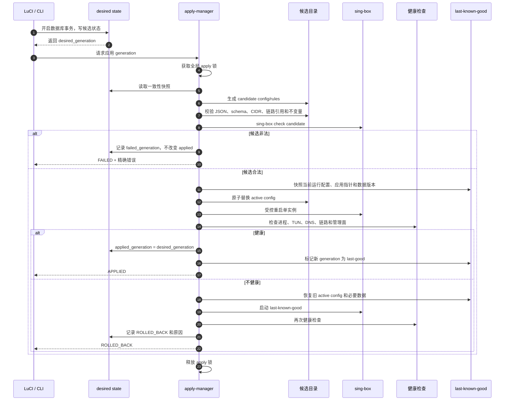

### 9.3 候选不变量

除 `jq`/JSON 语法和 `sing-box check` 外，apply-manager 还必须验证：

1. 每个启用链路至少有一个有效 hop；
2. 每个业务来源最多绑定一个默认链路；
3. 所有来源 CIDR 互不冲突；
4. 未登记来源的最终动作是 reject，不是 direct；
5. `local-dns.detour == direct`；
6. 不存在缺少生产 inbound、`source_ip_cidr`、专用 DNS 目的地址任一限定的 53 捕获；
7. `wg-mgmt`、总部地址段和 WireGuard endpoint 在 TUN 排除列表；
8. 规则集全部为已存在且校验通过的本地文件；
9. 所有 outbound 引用都存在；
10. 配置生成器不会直接覆盖 active 文件；
11. 数据库 schema 与当前应用版本兼容；
12. 业务 direct 规则必须同时具备业务来源限定和明确策略匹配。

## 10. 配置与运行目录

```text
/data/tiktokproxy/state/
  vps.db                         # 用户期望状态与 generation
  policies/                      # 用户策略

/data/tiktokproxy/runtime/
  candidate/<generation>/        # 候选配置和验证日志
  active -> generations/<id>/    # 当前运行配置
  last-good -> generations/<id>/ # 最近健康配置
  generations/<id>/              # 不可变生成结果
  apply.lock                     # 单一应用锁
```

sing-box init 脚本只读取 `runtime/active/config.json`。`generate-config.sh` 只能写 candidate，不能直接写 active；这消除“生成到一半就覆盖生产配置”的窗口。

## 11. 健康检查与可观测性

### 11.1 基础健康

- WAN 地址和默认路由存在；
- 指定 direct 探测地址可达；
- `wg-mgmt` handshake 在阈值内；
- SSH 与 LuCI 只在管理地址监听；
- DATA 可读写且数据库 `integrity_check` 通过；
- 系统时间可信。

### 11.2 业务健康

- sing-box 进程存在且 PID 稳定；
- `singbox-tun` 地址、路由和防火墙规则存在；
- 专用客户端 DNS 地址可对测试域名响应；
- CN 测试域名返回真实 IP并命中 direct；
- 代理测试域名返回 FakeIP；
- 每条启用链路完成受控 TCP/HTTPS 探测；
- 未登记源地址无法通过 WAN；
- sing-box 停止后管理面仍可访问。

### 11.3 日志与状态

每次配置应用记录：

```text
apply_id
device_id
desired_generation
previous_applied_generation
candidate_hash
initiator
start_at / finish_at
validation_result
restart_result
health_result
final_state: APPLIED | REJECTED | ROLLED_BACK
error_summary
```

日志有大小和保留期上限，敏感字段如 UUID、私钥和完整节点凭据必须脱敏。

## 12. 关键数据流示例

### 12.1 总部 SSH

```text
总部运维机
  → 总部 WireGuard 中心
  → 设备 wg-mgmt /32
  → mgmt zone
  → SSH

完全不经过 singbox-tun。
```

### 12.2 GitHub 应用升级

```text
总部通过 wg-mgmt 发升级命令
  → 设备固定升级器绑定 WAN
  → 下载精确 GitHub Release
  → 验签、暂存、候选检查
  → 原子切换
  → 结果通过 wg-mgmt 回报

下载与回报均不依赖业务链路。
```

### 12.3 下游路由器业务

```text
下游路由器 A 内部终端
  → NAT 成 192.168.20.11
  → OpenWrt prod zone
  → singbox-tun
  → source 192.168.20.11 命中 chain-A
  → CN 明确规则可 direct；其余默认 chain-A
```

### 12.4 sing-box 崩溃

```text
sing-box 退出
  → 生产流量因无 prod→wan 转发而被阻断
  → watchdog/apply-manager 尝试 last-known-good
  → wg-mgmt、SSH、LuCI、升级器继续工作
  → 总部仍可诊断或回滚
```

## 13. 验收与故障注入

### 13.1 物理与管理面

- 单 WAN/单 LAN 加非网管交换机时，总部管理不占 LAN VLAN；
- 设备经过上级 NAT 后仍可被总部稳定 SSH；
- 断开 sing-box、删除 TUN、配置无效三种场景下管理隧道都保持；
- 生产 LAN 扫描不到 SSH/LuCI；
- WireGuard endpoint 地址变化或 DNS 失败时有可观察错误，不把流量送入业务链路。

### 13.2 三种 LAN 模式

- 模式 A：整个桥接子网使用同一链路，未登记静态 IP不能绕过；
- 模式 B：两个下游 NAT 路由器分别稳定命中不同链路，换 IP/MAC 后 fail-closed；
- 模式 C：VLAN 之间二层/三层隔离，分别命中不同链路；
- 任一模式下管理地址都只存在于 `wg-mgmt`。

### 13.3 DNS

- 用 nft trace 证明捕获规则只命中 `prod` 入方向；
- 用 tcpdump 证明查询代理域名 A/AAAA 时 WAN 没有发出该域名的明文 DNS；
- 用抓包证明 CN DNS 只经 direct local-dns；
- 手工指定 8.8.8.8:53 的客户端查询仍进入显式 hijack；
- 路由器自身 NTP、WireGuard、升级 DNS 不命中客户端捕获；
- 删除所有外网 rule-set 可用性后，sing-box 仍使用本地规则集启动；
- FakeIP 映射、QUIC、UDP、非 A/AAAA 查询在目标 sing-box 1.11.5 上逐项验证。

### 13.4 事务和回滚

- 候选 JSON 错误、引用不存在、全局 53、错误 DNS detour 都在重启前被拒绝；
- `sing-box check` 失败时 active 不变；
- 新配置启动后健康失败时恢复 last-known-good；
- LuCI 始终同时显示 desired 与 applied generation；
- apply 过程中断电后，启动脚本只选择完整 active 或 last-good，不读取半成品。

## 14. 迁移顺序

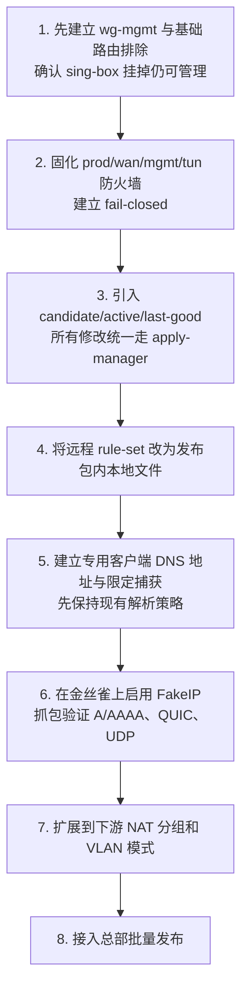

DNS 改造不是第一步。先把管理面和自动回滚建立起来，才有资格修改可能导致业务断联的 DNS/TUN 配置。

## 15. 设计决策摘要

| 问题 | 决策 | 原因 |
|---|---|---|
| 管理口是否使用 LAN VLAN | 否，使用 `wg-mgmt` | 不占物理 LAN，不依赖现场交换机 |
| 一个 LAN 如何扩多组 | 优先多个下游 NAT 路由器；有条件用业务 VLAN | 符合现有硬件现实 |
| sing-box 数量 | 单实例 | 配置、DNS 映射、规则和回滚只有一份 |
| sing-box 失败后是否直连 | 否，业务 fail-closed | 防止代理故障变成泄漏 |
| 客户端 DNS | 专用 TUN DNS + scoped capture + explicit hijack | 避免全局 53 误伤 |
| 国外 A/AAAA | FakeIP | 先路由后解析，避免国内真实外查 |
| 国内 DNS | `local-dns` direct | 独立、快速，不制造启动循环 |
| rule-set | 随签名 Release 本地化 | 启动不依赖 CDN |
| 配置写入 | candidate → check → atomic active → health → rollback | 不让半配置进入生产 |
| 页面状态 | desired/applied/last-good 分离 | 防止“数据库有、运行时没有”的幽灵数据 |

## 16. 参考依据

- 项目事故复盘：`docs/postmortem-2026-07-23-dns-disaster.md`
- 项目调研：`docs/research-dns-architecture.md`
- sing-box v1.11.5 官方源码文档：DNS server、FakeIP、TUN、route rule action、rule-set
- sing-box 当前官方文档：[DNS](https://sing-box.sagernet.org/configuration/dns/)、[TUN](https://sing-box.sagernet.org/configuration/inbound/tun/)、[Rule Action](https://sing-box.sagernet.org/configuration/route/rule_action/)、[Rule Set](https://sing-box.sagernet.org/configuration/rule-set/)
