# 运行时网络隔离、DNS 与事务化 sing-box 设计

> 日期：2026-07-28
>
> 状态：方案已确认，开发前细化与复核完成
>
> 适用范围：单 WAN/单 LAN 为主、可外接中继路由器或交换机的 x86 OpenWrt 跨境播软路由
>
> 核心结论：国内总部与设备之间使用内核 `wg-mgmt` 管理隧道；WireGuard 不进入任何海外节点或业务链路。WAN 上联使用“光猫路由/二级路由”和“光猫桥接/主路由”两个显式档案，复用 netifd/UCI，不猜测运营商参数；上联档案与 LAN 业务 profile 完全正交。基础网络不依赖 sing-box，业务面继续使用现有单 sing-box；上联与 sing-box 分别事务化应用并共享变更互斥门禁；业务失败时 fail-closed，管理面继续可达。

## 1. 事故结论与调研复核

本设计以 `docs/postmortem-2026-07-23-dns-disaster.md` 为强制约束，并复核了 `docs/research-dns-architecture.md` 与 sing-box 1.11.5 官方配置文档。

### 1.1 已确认结论

1. `dns.servers[].detour` 控制 sing-box 连接该 DNS 服务器时使用的出站。
2. `local-dns` 是基础解析通道，必须保持 `direct`，不能依赖待启动的 VLESS 链路。
3. 全局目的端口 53 规则会同时匹配路由器自身或 sing-box 自身流量，不能用于客户端 DNS 防泄漏。
4. sing-box 1.11.5 支持旧格式 FakeIP：`dns.fakeip` 与 `address: "fakeip"`。
5. sing-box 1.11.5 支持显式路由动作 `action: "hijack-dns"`，它才表示把匹配的 DNS 请求送入 sing-box DNS 模块。
6. TUN 的 `auto_route` 负责设置路由，不等价于“客户端 DNS 自动进入 sing-box DNS 模块”。
7. 远程 rule-set 在启动时可能下载；如果下载依赖代理链路，就仍可能形成启动依赖。

### 1.2 对调研文档需要修正或补证的部分

| 原调研表述 | 复核结论 | 设计处理 |
|---|---|---|
| “TUN 默认劫持客户端 DNS 到 DNS 模块” | 对 1.11.5 不能这样概括；需要显式 `hijack-dns`，而发往路由器本机 dnsmasq 的流量还可能先走内核 local 路径 | 使用独立 TUN DNS 地址、生产入口定向捕获、显式 `hijack-dns` |
| 当前 Mac DNS 完整经过 sing-box DNS 模块 | 当前生成配置没有 `hijack-dns`，项目也没有保存证明该路径的抓包证据 | 上线前以 nft trace、tcpdump 和 sing-box 日志验证，不把推测当现状 |
| FakeIP 架构“没有循环依赖” | FakeIP 本身不需要外部解析，但远程规则集、节点域名和非 A/AAAA 查询仍可能有依赖 | rule-set 随应用包本地化；节点优先使用 IP；保留独立 direct bootstrap DNS |
| `reverse_mapping` 等价于 FakeIP 映射 | 二者用途相关但不是同一机制；reverse mapping 依赖应用先解析真实地址 | 代理域名直接使用 FakeIP，不以 reverse mapping 代替 |
| `proxy-dns` 从国内直连可达且可避免污染 | 可达性和结果可信度都不能保证 | 国外 A/AAAA 不直连查询，返回 FakeIP；其他查询按业务链路处理 |

因此，调研对“DNS 需要在路由决策之前避免真实外查、FakeIP 优于事后 sniff 补救”的方向是正确的；但对当前实际数据路径的描述证据不足，不能原样当作生产架构。

### 1.3 当前代码复核

本次进入开发前对仓库实际实现再次核对，确认以下不是推测：

| 代码位置 | 当前事实 | 设计结论 |
|---|---|---|
| `openwrt/luci/view/tiktokproxy/network.htm` | 只有状态、拓扑和设备展示，没有 WAN 模式、协议或候选配置入口 | 在原页面增加上联档案，不创建平行网络后台 |
| `action_network_data` / `chain-diagnostics.sh` | 只读现有 `network.wan`，把 WAN 当成固定 DHCP 上联 | 状态 API 改读 netifd 逻辑 `wan`，不能按物理设备类型判断协议 |
| `init-subnets.sh` / `_subnet-lib.sh` | 动态枚举物理口、拆 `br-lan`、允许拆光最后成员，并把备份放 `/tmp` | 不复用为量产网络引擎；由显式 profile 和 DATA 下持久 last-good 替代 |
| `generate-config.sh` | 直接覆盖 `/etc/sing-box/config.json`，生成前还执行迁移 | 生成器必须纯候选输出，迁移和切换由上层事务处理 |
| `generate-config.jq` | `route.final=direct`、远程 rule-set、debug 文件日志、固定 TUN MTU 1500 | 分阶段改为 fail-closed、本地 rule-set、有界 info 日志；MTU 先实测 |
| `tiktokproxy.lua` | 多个 API 各自 generate/check/stop/kill/start，并同步访问公网 | 收敛到网络与 sing-box 两个唯一写入口，状态 API 只读本地缓存 |
| controller 路由 | 引用了仓库中不存在的 settings/traffic/update 页面和若干脚本 | M0 必须补齐、替换或删除，不能打入可发布清单 |
| 仓库测试 | 没有网络事务、DNS 范围、升级回滚和吞吐门禁 | 每个迁移阶段先建立失败测试和实机证据 |

GitNexus 本地检查显示该仓库尚未建立索引；为避免索引命令生成或改写仓库上下文文件，本次复核按项目降级规则使用源码和 `rg` 完成。开始编码前是否建立知识图谱不影响方案，但任何实现者仍需按调用点逐项验证。

## 2. 设计目标

1. sing-box 崩溃、配置错误或链路不可用时，总部仍能 SSH、打开管理页面和执行回滚。
2. 管理逻辑网络不占用 LAN 物理口，也不要求现场交换机支持 VLAN。
3. 一个物理 LAN 口可以按现场设备能力支持一组或多组业务终端。
4. 客户端业务流量不得在代理失败时偷偷从 WAN 直出。
5. 国内域名和地址可以按策略直连；国外代理域名不在国内发出真实 A/AAAA 查询。
6. 路由器自身启动、时间同步、WireGuard、升级和规则加载不依赖 sing-box 业务链路。
7. 配置修改必须是事务：全部验证成功才生效，失败恢复上一已知良好版本。
8. LuCI 展示必须区分“用户想要的配置”和“设备实际运行的配置”，不产生幽灵数据。
9. WireGuard 只连接国内总部管理中心，不允许海外 VPS 成为 WireGuard peer，也不允许业务流量、客户端 DNS 或 VLESS 出站绕入 `wg-mgmt`。
10. 本设计包含应用代码/配置的远程升级与回滚，但不包含 x86 工厂刷机和 OpenWrt 基础固件 OTA；待运行时架构完成并验证后再回顾工厂方案。
11. 支持后台配置两种 WAN 上联：光猫路由模式下的 DHCP/静态地址，以及光猫桥接模式下的 PPPoE、DHCP/IPoE 或静态地址；可选 VLAN、MAC 克隆和运营商高级参数。
12. 上联档案与 LAN 模式 A/B/C 分开保存、分开验证、分开应用；改变上联不能重建节点、链路、策略、子网或 sing-box 用户数据。
13. 光猫模式由运营商人员在外部修改，系统只负责 OpenWrt 一侧；桥接迁移必须先保存并预置候选、限时 armed cutover，并提供不占独立物理口的本地恢复入口。
14. IPv6 能力按完整双栈 fail-closed 单独交付；在 IPv6 防火墙、DNS、TUN、FakeIP 和泄漏测试通过前，生产默认关闭 IPv6。

## 3. 五个平面

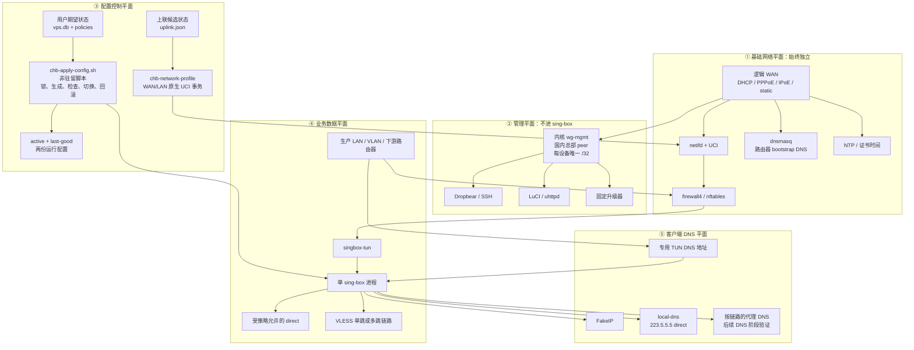

核心依赖方向是：

```text
基础网络 → 管理面
基础网络 → sing-box
上联控制面 → netifd/UCI
配置控制面 → sing-box

禁止：
管理面 → 依赖 sing-box 才能工作
基础 DNS → 依赖 VLESS 链路才能启动
升级器 → 通过业务 TUN 才能访问 GitHub
```

这里的“五个平面”是依赖边界，不是五个新服务。最终实现继续复用 netifd、dnsmasq、firewall4、procd、LuCI、SQLite 和单 sing-box；第一批只增加：

1. 一个由 OpenWrt 内核 WireGuard 驱动承载的 `wg-mgmt` 接口；
2. 一个执行完即退出的 `/usr/bin/chb-network-profile` 网络档案脚本；
3. 一个执行完即退出的 `/usr/bin/chb-apply-config` sing-box 配置脚本；
4. 只在桥接切换窗口内运行的上联 watcher 和本地恢复入口。

不新增常驻 apply-manager、第二个 DNS 服务、第二个 sing-box、永久 LAN 管理服务、指标采集 daemon 或自定义 WireGuard 用户态服务。

## 4. 国内总部管理网络：不用管理 VLAN，不占 LAN 口

### 4.1 推荐拓扑

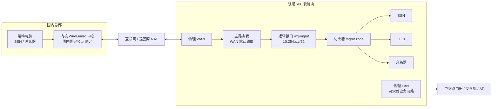

`wg-mgmt` 是三层逻辑管理接口，不是 `eth1.<vlan>`，因此：

- 不消耗 LAN 物理端口；
- 不要求现场交换机支持 VLAN；
- 不和业务广播域混在一起；
- 设备在 NAT 后也能主动连接总部；
- 总部使用固定管理 IP，不依赖现场 WAN 地址变化。

### 4.2 WireGuard 使用边界

WireGuard 在本系统中只有“国内远程管理”一个职责：

```text
国内总部运维机
  → 国内 WireGuard 中心
  → 设备 wg-mgmt /32
  → SSH / LuCI / 升级命令
```

强制限制：

- 设备使用 OpenWrt 内核 WireGuard，不使用 sing-box WireGuard outbound/endpoint；
- Hub 必须部署在国内，不得把日本、美国或其他海外 VPS 配成 WireGuard peer；
- 总部运维机作为 Hub 的独立 ops peer，Hub 只转发 ops 管理池到设备 `/32`；设备只信任 Hub 公钥，不和每台运维机或其他设备组成 mesh；
- 设备端 `AllowedIPs` 只包含总部管理地址段，例如 `10.254.0.0/16`，禁止 `0.0.0.0/0` 和 `::/0`；
- Hub 为每台设备只声明该设备唯一的 `/32` 管理地址；
- WireGuard endpoint 使用国内固定 IPv4，避免隧道启动再依赖代理 DNS；
- `mgmt` zone 只允许到设备本机 SSH/LuCI/升级接口，`forward` 永久 REJECT；
- VLESS 节点、客户端 DNS、生产 LAN 和 sing-box direct outbound 都不得引用 `wg-mgmt`；
- GitHub Release 下载仍绑定基础 WAN 直连；管理隧道只传输升级命令和状态。

### 4.3 路由隔离

管理隧道必须明确绕开 sing-box：

1. WireGuard 公网 endpoint 的主机路由固定走 WAN 网关；
2. sing-box TUN 优先通过生产入口白名单只捕获 `prod`，并明确排除 `wg-mgmt`、WireGuard endpoint 和总部管理地址段；
3. 升级器绑定 WAN 访问 GitHub Release；
4. 默认不增加独立管理策略路由表；只有实机 `ip route`、nft trace 证明上述原生路由仍被 TUN 捕获时，才增加专用规则表；
5. firewall4 禁止生产 LAN 进入 `mgmt` zone；
6. SSH/LuCI 可以保持本机监听以避免 `wg-mgmt` flap 后服务未重新绑定，但 firewall4 只允许 `mgmt` zone 进入 22/443；WAN 和生产 LAN 到这些端口永久拒绝。限时恢复服务使用独立 uhttpd/端口，不放宽完整 LuCI。

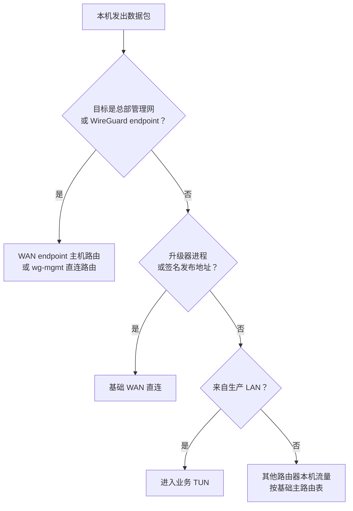

### 4.4 防火墙 zone

| Zone | 接口 | input | output | forward | 用途 |
|---|---|---:|---:|---:|---|
| `wan` | 物理 WAN | REJECT | ACCEPT | REJECT | 基础互联网 |
| `mgmt` | `wg-mgmt` | 仅国内总部允许 | ACCEPT | REJECT | SSH、LuCI、升级命令 |
| `prod` | 业务 LAN/VLAN | 仅 DHCP、必要 ICMP；DNS 先 scoped DNAT | ACCEPT | 默认 REJECT | 终端接入 |
| `tun` | `singbox-tun` | REJECT | ACCEPT | 受控 | sing-box 业务数据 |

特别规则：

- 不建立通用 `prod -> wan` forwarding；
- 只允许生产流量进入 sing-box 捕获路径；
- 生产入口的 TCP/UDP 53 在进入本机 dnsmasq 前定向改写到专用 TUN DNS 地址，dnsmasq 只承担 DHCP 和路由器 bootstrap 解析；
- 允许 sing-box 自身按配置访问 WAN/VLESS；
- `mgmt` 不转发到 `prod`、`wan` 或海外 VPS；总部只访问设备本机管理服务；
- 路由器本机 direct 与生产终端 direct 必须可区分，不能用一个宽泛源地址规则。

## 5. 双上联档案：光猫路由与光猫桥接

### 5.1 边界与两个正交维度

移动光猫的配置、认证资料下发和桥接操作由运营商人员负责，本系统不登录、不修改、不恢复光猫。后台只配置 OpenWrt 的 WAN。为避免“旁路由”一词同时指单臂旁路由和二级路由，产品页面使用以下名称：

| 后台名称 | 光猫状态 | OpenWrt 角色 | OpenWrt WAN | 影响范围 |
|---|---|---|---|---|
| 光猫路由模式 | 光猫拨号并提供 NAT/DHCP | 二级路由 | DHCP，必要时 static | 只管理 OpenWrt LAN 后设备；其他光猫设备不受影响 |
| 光猫桥接模式 | 光猫只做二层桥接 | 主路由 | PPPoE、DHCP/IPoE 或 static | OpenWrt 管理其 LAN 后全部设备 |

这不是 LAN 模式 A/B/C 的第四种模式。设备最终状态是两个维度的组合：

```text
uplink_profile ∈ {ont-router, ont-bridge}
lan_profile    ∈ {mode-a, mode-b, mode-c}

设备网络状态 = uplink_profile × lan_profile
```

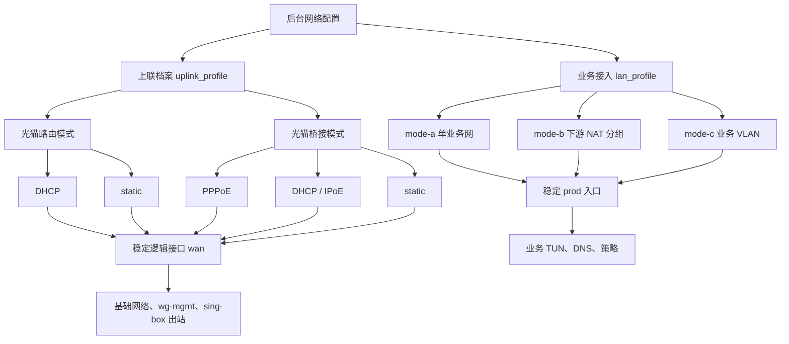

上联改变时逻辑接口名始终保持 `wan`；LAN 改变时只修改 `prod` 入口集合。节点、链路、策略、`vps.db` 和 sing-box 用户数据都不因上联改变而重建。

### 5.2 兼容范围与候选档案

运营商未知时采用“显式参数 + 只读探测”，不做协议、VLAN 或 MAC 的全自动穷举。首期覆盖固定宽带常见组合：

| 能力 | 字段 |
|---|---|
| 物理接口 | `device`，必须是明确物理 WAN，不能与 LAN 相同 |
| IPv4 协议 | `dhcp`、`pppoe`、`static` |
| 802.1Q | `vlan_id=null` 或 1–4094 |
| MAC | 可选 `mac_clone` |
| DHCP/IPoE | `hostname`、`client_id`、`vendor_class`、运营商/手工 DNS |
| PPPoE | 用户名、密码、Service Name、AC Name、Host-Uniq、运营商/手工 DNS |
| static | CIDR 地址、网关、DNS |
| 链路 | MTU 自动或手工；PPPoE 可单独设置 MRU |
| IPv6 | `off` 或后续门禁通过后的 `native-pd` |
| 本地恢复 | 默认 `192.168.255.1/24`，允许在保存前改成不冲突网段 |

权威候选保存在 `/data/tiktokproxy/state/uplink.json`，权限固定为 0600；`/etc/config/network` 只是当前已应用档案的 OpenWrt 原生投影，不作为用户配置迁移源。最小 schema：

```json
{
  "schema": 1,
  "mode": "ont-router",
  "protocol": "dhcp",
  "device": "eth1",
  "vlan_id": null,
  "mac_clone": null,
  "mtu": null,
  "mru": null,
  "dns": {
    "peerdns": true,
    "servers": []
  },
  "dhcp": {
    "hostname": "",
    "client_id": "",
    "vendor_class": ""
  },
  "pppoe": {
    "username": "",
    "password": "",
    "service_name": "",
    "ac_name": "",
    "host_uniq": ""
  },
  "static": {
    "address": "",
    "gateway": ""
  },
  "ipv6": {
    "mode": "off"
  },
  "recovery_cidr": "192.168.255.1/24"
}
```

交叉校验：

1. `ont-router` 只允许 `dhcp|static`，`ont-bridge` 允许 `pppoe|dhcp|static`；
2. `pppoe` 必须有用户名和密码；
3. `static` 的地址、网关和 DNS 必须合法且网关可从该地址到达；
4. VLAN、MTU、MRU、MAC 和 DHCP 标识严格校验，空值不下发到 UCI；
5. WAN 设备不得是 `lo`、bridge、TUN、WireGuard、无线接口、当前 LAN 成员或不存在的接口；
6. 恢复网段不得与 WAN、LAN、业务 VLAN、TUN、WireGuard 管理网重叠；
7. `ipv6.mode=off` 时不得生成 `wan6` 或向生产 LAN 下发 RA/DHCPv6；
8. 密码、MAC、Client ID 和 Host-Uniq 不进入普通日志；状态 API 只返回 `credential_configured=true|false`。

暂不实现多 WAN、负载均衡、802.1X、Option 82、DS-Lite、MAP-E 或自动 VLAN 扫描。没有真实运营商需求和测试线路时，这些功能只会扩大故障面；后续通过 `schema` 升级增加明确字段，不提供任意 UCI 文本透传。

### 5.3 后台交互与只读探测

当前 `network.htm` 只有状态展示。升级后同一页面增加“当前运行”“上联配置”“LAN profile”“切换与恢复”四个区块，不另建第二套网络页面。

页面同时显示：

| 状态 | 含义 |
|---|---|
| `desired` | 用户最近保存的候选档案，尚不代表已运行 |
| `active` | 当前 UCI/netifd 正在运行的档案 |
| `last-good` | 最近一次通过本地健康检查的可恢复档案 |
| `switch_state` | `IDLE/SAVED/ARMED/APPLYING/ACTIVE/ROLLED_BACK/RECOVERY_REQUIRED/EXPIRED` |

“保存候选”和“激活”必须是两个按钮。普通字段默认展开，VLAN、MAC、DHCP 标识、PPPoE Service/AC/Host-Uniq、MTU/MRU 放入高级设置。密码读取时永不回显；提交空密码表示保留已有凭据，明确点击“清除凭据”才删除。凭据只写入 root 可读的 DATA 文件和 active UCI 投影；不增加无法抵御 root 的设备内自加密层。

探测只回答“当前指定设备与指定 VLAN 上是否看到了信号”：

- 读取物理 carrier；
- 对 `dhcp` 候选发送不落地配置的 DHCP Discover，记录 Offer；
- 对 `pppoe` 候选执行 PPPoE discovery，记录 PADO；
- 对 static 只做格式、ARP 冲突和网关邻居检查；
- VLAN 只探测用户填写的一个 VLAN，不扫描 1–4094；
- 探测结果是建议，永不自动保存、自动激活或推断账号密码。

### 5.4 普通事务与桥接 armed cutover

同一光猫模式内修改 DHCP、static、VLAN、MAC 或 PPPoE 参数，执行普通事务；“光猫路由 → 光猫桥接”必须使用 armed cutover：

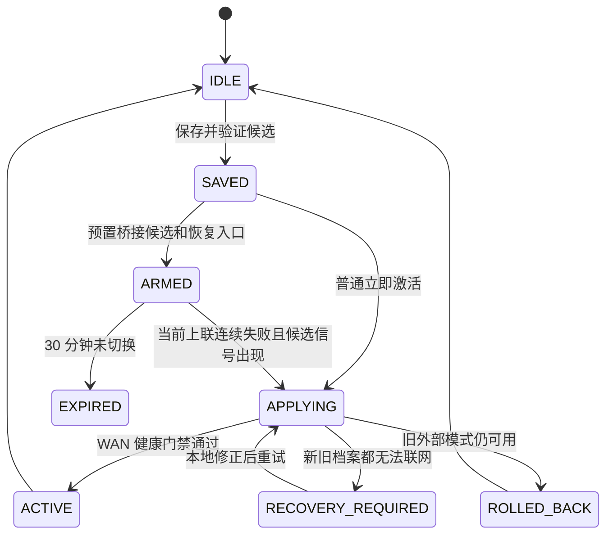

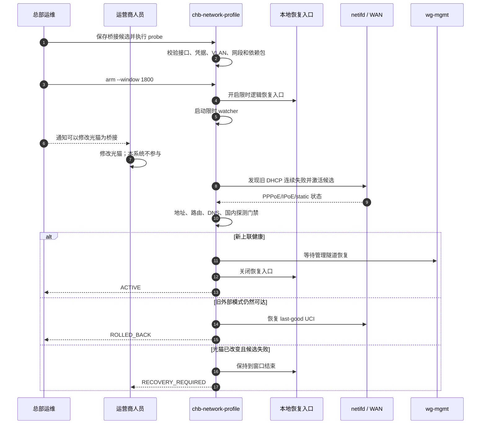

实现复用 netifd/UCI，只修改脚本拥有的命名 section；不替换整个网络栈，不重新实现 DHCP/PPPoE。切换前备份 `/etc/config/network`、`firewall`、`dhcp` 和 active profile，候选先生成 UCI batch 并静态检查，再提交和 reload。`wan` 逻辑名保持不变，因此 `wg-mgmt` endpoint 主机路由、升级器和 sing-box 不需要知道底层是 DHCP、PPPoE 还是 VLAN。

产品后台把本页面作为唯一受支持的 WAN/LAN 写入口，默认隐藏标准 LuCI 网络写菜单。root 通过 SSH 直接修改 UCI 无法被技术上禁止，因此事务在快照后、commit 前再次比较 network/firewall/dhcp 哈希；发现外部改动就返回 `CONCURRENT_UCI_CHANGE`，不覆盖对方修改。

普通事务和 armed cutover 的健康门禁分开：

- 普通事务失败且旧外部模式仍在：自动恢复 last-good；
- 光猫已由外部改成桥接时，旧 DHCP 档案本身已失效，不能把“写回旧 UCI”宣传成恢复；
- armed watcher 连续三次确认当前上联失败后才切换，单次丢包或 DHCP 续租抖动不触发；
- watcher 最长运行 30 分钟，成功、取消或过期立即退出，不是常驻服务；
- WAN 健康需要 carrier、地址、默认路由、bootstrap DNS，以及两个不同国内 DNS 地址的 UDP/TCP 查询门禁；私网/CGNAT 地址是合法结果；
- `wg-mgmt` 最近 handshake 是管理可达性指标，不作为唯一 WAN 正确性判断；Hub 自身故障不能导致反复改 WAN；
- 海外 VPS、GitHub 和业务链路不参与上联成功门禁。

### 5.5 不占物理口的本地恢复入口

WAN 失败时 `wg-mgmt` 必然不可用，因此桥接切换必须有本地 break-glass；它不是日常管理 VLAN，也不是永久 LAN LuCI：

1. `arm` 时在当前 LAN 设备增加一个逻辑恢复地址，默认 `192.168.255.1/24`，不占独立端口；
2. 现场人员把电脑临时设为同网段静态地址后访问 `https://192.168.255.1:8443`；
3. 独立 uhttpd 实例只绑定恢复地址和 8443，只在 ARMED/RECOVERY_REQUIRED 窗口运行；
4. 一次性 token 只显示一次，首次验证后立即作废并换成绑定客户端 IP、HttpOnly、SameSite=Strict 的短会话；
5. 页面只有“查看 WAN 状态”“校正并重试候选”“恢复 last-good”三个动作；重试表单只允许 schema 1 已定义的 WAN 字段，密码不预填，不开放完整 LuCI、SSH、shell 或文件上传；
6. CGI 把固定字段组装成 0600 临时 JSON，再交给主脚本执行完整校验；不接受任意 path/UCI/command，不拼接用户 shell 参数；
7. 成功、取消或 30 分钟过期后删除防火墙规则、恢复地址、token/session 和临时进程；
8. 恢复网段冲突时 `arm` 必须拒绝，不能临时猜另一个地址。

这是一项运行时桥接迁移的安全例外。日常 SSH/LuCI 仍只允许国内 `wg-mgmt`；生产 LAN 平时扫描不到管理服务。

### 5.6 MTU、IPv6 与管理路由

- DHCP/IPoE 默认使用设备协商 MTU，通常为 1500；PPPoE 默认由 netifd 协商，常见为 1492。只有运营商明确要求或 PMTU 测试失败时才手工设置 MTU/MRU。
- 当前 sing-box TUN 固定 `mtu=1500` 不能直接假设对所有 PPPoE/VLAN 组合最优。开发阶段分别测量 DHCP、PPPoE、VLAN+PPPoE 的 TCP、UDP、QUIC、直播推流和分片行为，再决定是否按上联档案生成 TUN MTU；没有数据不改默认值。
- WireGuard Hub endpoint 使用 IPv4 字面量并始终通过逻辑 `wan` 解析下一跳。无论底层设备最终是 `eth1`、`eth1.<vid>` 还是 `pppoe-wan`，都不把物理设备名写进业务规则。
- 生产默认 `ipv6.mode=off`：不申请 PD、不向 LAN 发 RA、不生成生产 IPv6 默认直连。`native-pd` 只有在后续双栈门禁中验证 prod IPv6 同样经过 TUN、国外 AAAA 使用 FakeIP、CN IPv6 direct 有来源限定、sing-box 失败时 IPv6 也 fail-closed 后才开放。

## 6. 单物理 LAN 的三种业务接法

管理面始终使用 `wg-mgmt`，以下差别只影响业务终端如何分组。

三种模式是部署 profile，不是运行时自动切换引擎。每台设备只启用一种明确 profile；默认单 WAN/单 LAN 镜像不动态发现网口、拆桥或运行 `init-subnets.sh`。

### 6.1 模式 A：非网管交换机或 AP/中继桥接

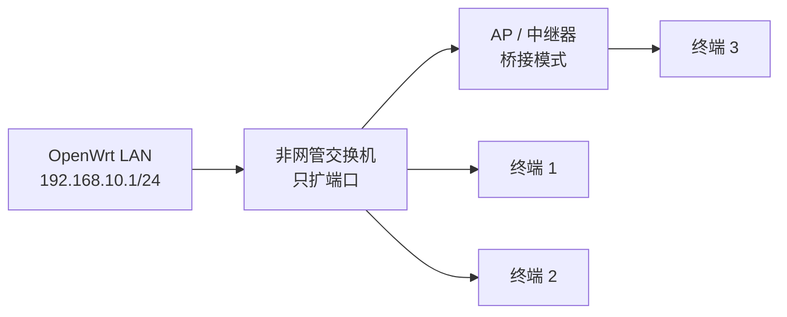

能力：

- 所有终端位于一个二层广播域和一个生产子网；
- 最稳妥的是整个子网绑定一条链路和一份策略；
- 可以用 DHCP 静态租约按源 IP 做细分，但这不是安全隔离，终端改静态 IP 可能冒充另一组；
- 不能仅靠非网管交换机实现多个相互隔离的业务网络。

适用：一个现场只需要一条业务链路，或终端彼此可信。

### 6.2 模式 B：多个下游路由器使用 NAT/路由模式

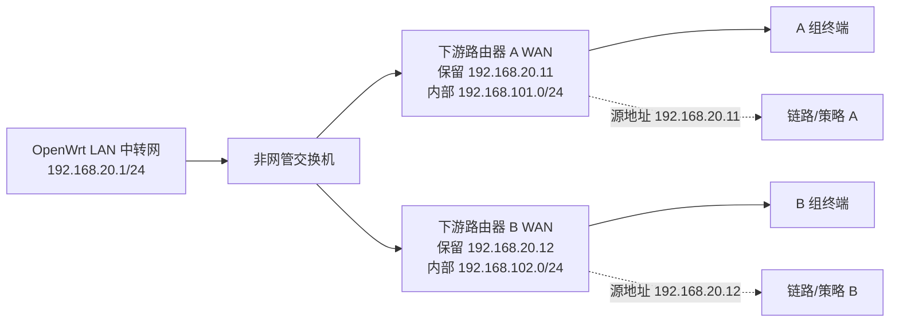

做法：

1. 下游路由器工作在 NAT/路由模式，不是 AP 桥接模式；
2. OpenWrt 根据下游 WAN MAC 分配固定 IP；
3. 复用现有 `chains.source_cidr=<固定IP>/32`、`ap_ip` 和 `ap_mac` 绑定链路，不新增“终端组”数据表；
4. 未登记或 IP/MAC 不一致的设备 fail-closed；
5. 每个下游路由器内部终端被 NAT 聚合成一个可识别源地址。

优点：

- 仍可使用普通非网管交换机；
- 一个物理 LAN 可以承载多组业务和多条链路；
- 分组比按终端 IP 管理简单。

限制：

- 下游路由器之间仍共享 OpenWrt 一侧的二层中转网；
- 隔离主要来自下游 NAT/防火墙，不等同于 VLAN；
- 一个下游路由器内的所有终端默认使用同一链路；
- DHCP 固定租约和数据库绑定必须一致，否则应阻断而不是回落直连。

这是当前“一个 LAN 口 + 普通交换机 + 多组业务”最实用的方案。它是运营分组，不是对抗恶意终端的安全边界；需要可信隔离时必须使用 VLAN 模式。

### 6.3 模式 C：网管交换机或支持 VLAN 的 AP

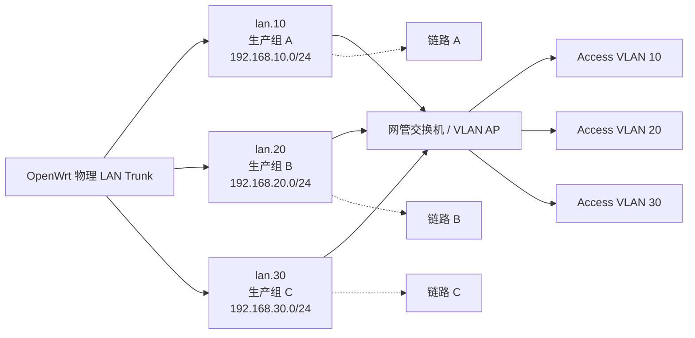

这是隔离能力最强的接法。LAN 口承载多个业务 VLAN，但管理网仍然不放在这些 VLAN 中，依旧走 `wg-mgmt`。VLAN profile 由确定性 UCI 模板创建，不复用当前按物理口动态拆网逻辑。

### 6.4 选择表

| 现场设备 | 可支持业务组 | 隔离强度 | 推荐 |
|---|---:|---|---|
| 非网管交换机 + AP 桥接 | 1 个可靠组 | 低 | 单链路场景 |
| 非网管交换机 + 多个 NAT 路由器 | 每个下游路由器 1 组 | 中 | 当前多组业务首选 |
| 网管交换机/VLAN AP | 多 VLAN | 高 | 规模化、强隔离 |

## 7. 业务数据路径

### 7.1 单 sing-box

所有业务组进入一个 sing-box 进程，通过源子网或下游路由器保留 IP 选择链路：

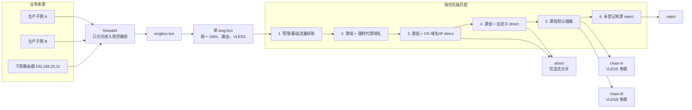

单进程的原因：

- DNS FakeIP 映射、规则集和链路状态只有一份；
- 配置可以整体生成、整体检查和整体回滚；
- 不需要为每个子网维护一套进程、端口、日志和启动顺序；
- 当前业务规模下，进程隔离带来的复杂度大于收益。

当前系统本来就是单 sing-box，因此“单实例”是保留决策，不计作性能优化。性能改善来自缩小 TUN 捕获范围、减少 debug 日志、取消固定 sleep、使用本地 rule-set，并在实测后决定是否启用 sing-box 原生 `auto_redirect`。若未来实测单进程达到 CPU、内存或文件描述符瓶颈，再按测量结果拆实例。

### 7.2 fail-closed

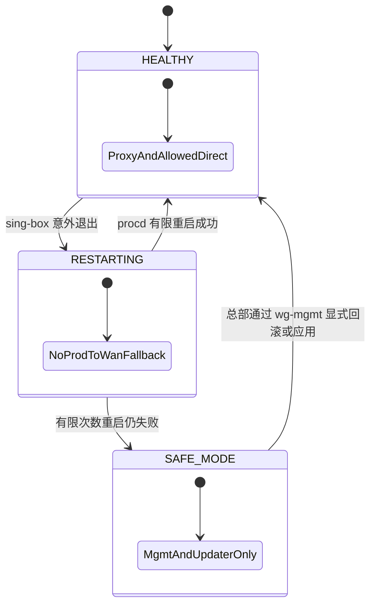

sing-box 失败时：

- 生产终端不能上网，避免流量泄漏；
- `prod -> wan` 没有兜底转发；
- WAN、WireGuard、SSH、LuCI、升级器保持正常；
- 本次 apply 健康门禁失败时，`chb-apply-config` 自动恢复 last-good；
- 已经运行的 sing-box 意外退出时，procd 只做有限次数重启；连续失败后进入 safe mode，由总部执行 `chb-apply-config --rollback` 或修复后重新应用。

这是“业务暂时不可用但数据不泄漏、设备仍可修复”，而不是“为了不断网自动直连”。

这会改变现有 UI 语义：当前“解绑链路”“禁用链路”“关闭代理”会回落 direct；新架构中三者都必须显示“业务已阻断”。默认不提供直连兜底。若现场以后确实需要维护直连，只能增加由国内总部显式授权、带失效时间并记录审计日志的 maintenance-direct，不能通过普通解绑隐式开启。

## 8. 客户端 DNS 设计

本节描述最终目标，不在第一批升级中一次性启用。DNS 分两次独立发布：

1. 先建立 scoped DNS capture 与显式 `hijack-dns`，但保持当前解析策略，证明路由器自身 DNS 不被误伤；
2. 再在单独金丝雀版本启用 FakeIP，并验证 A/AAAA、HTTPS RR、QUIC、STUN、私有域名和缓存行为。

DNS 阶段不同时升级 sing-box 大版本。运行时隔离首先固定现有 1.11.5；若后续选择新版本，版本迁移和 FakeIP 行为变更必须拆成不同发布。

### 8.1 两条完全分离的 DNS 路径

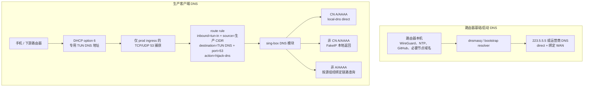

红线：

- 不添加无来源约束的全局 port 53 规则；
- 捕获规则只挂在 `prod` 入方向，并同时限定生产 CIDR、专用 TUN DNS 目的地址和 TCP/UDP 53；
- 路由器 OUTPUT、本地 dnsmasq、`wg-mgmt` 和升级器不进入捕获规则；
- `local-dns` 永远 `detour: direct` 并绑定 WAN；
- sing-box 配置启动不再在线下载 rule-set。

### 8.2 国外域名 FakeIP 流程

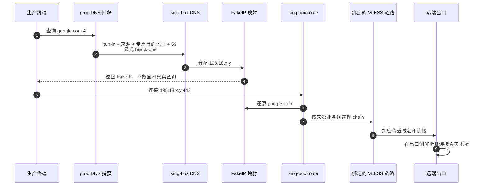

### 8.3 国内域名直连流程

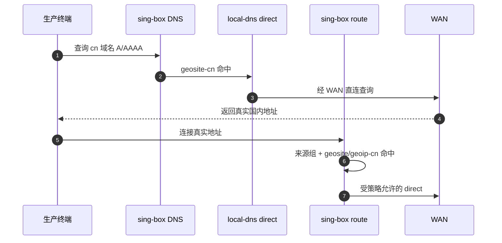

“DNS direct”只表示这次国内解析请求直连，不等于所有后续业务流量直连。最终连接仍需经过来源组路由规则。

### 8.4 客户端绕过处理

客户端手工设置 `8.8.8.8` 时，生产入口捕获把该 TCP/UDP 53 请求送往专用 DNS 路径；DoH/DoT 不属于普通 53 端口：

- 已知 DoH/DoT 域名和 IP 可由策略阻断或强制代理；
- 浏览器内置 DoH 需要终端策略配合，不能仅凭端口 53 完全控制；
- 对 QUIC、ECH 等场景不能只依赖 SNI sniff，FakeIP 映射是主路径；
- 不能承诺在未知加密 DNS 服务不断变化时仅靠路由器规则做到永久、百分之百识别。

## 9. 本地规则集、应用发布与启动依赖

当前远程 rule-set 可能在 sing-box 启动时访问 CDN。新架构把生产规则集作为应用 Release 的签名内容随包下发：

```text
/data/tiktokproxy/current/rules/
  geosite-cn.srs
  geoip-cn.srs
  policy-*.srs
```

应用 OTA 在切换前完成：

1. 下载发布包；
2. 验证签名和哈希；
3. 校验所有本地 rule-set；
4. 生成候选 sing-box 配置；
5. 执行目标版本 `sing-box check`；
6. 原子切换应用和规则目录；
7. 重启并健康检查；
8. 失败恢复旧应用、旧规则和旧配置。

运行时 sing-box 不把“首次下载远程规则集成功”作为启动前提。规则更新走统一应用发布流程，不在每台设备上自行漂移。

应用升级复用 `docs/superpowers/specs/2026-07-28-x86-factory-image-and-updater-design.md` 中的“不可变版本目录 + 原子 current 链接 + 用户数据独立”模型，但本阶段只落地应用升级，不落地工厂盘、磁盘重分区或基础固件 A/B：

```text
/data/tiktokproxy/
  releases/app-vX.Y.Z/           # 只读应用代码、LuCI、脚本、本地规则集
  current -> releases/app-vX.Y.Z # 原子切换
  state/                         # vps.db、policies、uplink/lan profile，发布包禁止包含
  runtime/                       # sing-box 与 uplink 的 active、last-good、状态哈希
  backups/<upgrade_id>/          # 仅 schema 迁移前创建，有界保留
```

设备端应用升级器和总部批量脚本都执行完即退出，不新增常驻发布服务。`chb-update`、`chb-mgmt`、`chb-network-profile`、网络恢复 guard 和 sing-box procd 脚本属于固定基础层，普通应用 Release 不得覆盖它们；当前开发阶段通过版本化 Git 部署一次，未来由工厂镜像固化。

设备只接受精确、已签名的 GitHub Release；先下载和验签，再在数据库副本执行兼容迁移、生成候选配置并调用 `chb-apply-config`，最后原子切换 `current`。任一步失败都保持旧应用和原用户数据；切换后本地健康失败则同时恢复旧链接、数据库及 policies 快照。发布包必须拒绝携带固定基础层、`state/`、`runtime/`、`backups/`，升级器不得递归删除 `/data/tiktokproxy`。

总部只通过国内 `wg-mgmt` 发送精确版本的预检和升级命令；设备经基础 WAN 下载 GitHub Release。发布顺序固定为“全量预检 → 单机金丝雀 → 观察 → 小批量 → 扩大”，任一波超过失败阈值立即停止，不追求所有设备同秒更新。

## 10. 两类最小事务化配置应用

网络档案与 sing-box 配置不能共用一个生成器：

| 事务 | 唯一写入口 | 修改范围 | 不得修改 |
|---|---|---|---|
| WAN/LAN 网络档案 | `/usr/bin/chb-network-profile` | 脚本拥有的 UCI network/firewall/dhcp section | `vps.db`、policies、节点、链路、应用版本 |
| sing-box 业务配置 | `/usr/bin/chb-apply-config` | DATA 下 candidate/active/last-good 和 sing-box 进程 | UCI WAN/LAN、用户期望数据 |

两者与 `chb-update` 共享 `/var/lock/chb-mutation.lock`，避免网络切换、业务配置切换和应用升级并发。顶层操作写入 `operation_id`、PID 和 boot ID；`chb-update → chb-apply-config` 只有携带与锁内一致的 parent operation 才能复用锁。普通脚本不能因为锁文件“看起来旧”就抢占；只允许在 boot ID 改变或同一 boot 下 PID 明确不存在时清理。

### 10.1 数据状态

| 状态 | 含义 | LuCI 展示 |
|---|---|---|
| `desired_hash` | 当前 vps.db 与 policies 一致性快照的 SHA-256 | “待应用”或“应用中” |
| `applied_hash` | 当前 sing-box 实际运行配置对应的期望状态哈希 | “运行中” |
| `last_good_hash` | 最近一次可恢复的本地健康配置哈希 | “可回滚” |
| `last_error` | 最近一次失败阶段和精确错误 | “应用失败” |

只有 `applied_hash == desired_hash` 时，页面才能显示“已生效”。保存数据库成功但运行配置失败时，用户期望数据保留为“待应用”，运行时继续使用 last-good；普通配置失败不回滚或删除用户数据库。数据库备份只用于应用升级/schema 迁移，不在每次路由配置应用时复制整套历史。

### 10.2 sing-box 单一写入口

LuCI、命令行和升级迁移都不能各自直接重启 sing-box。它们只调用唯一的 `/usr/bin/chb-apply-config`。该脚本获取锁、执行一次事务后退出，不是常驻 daemon：

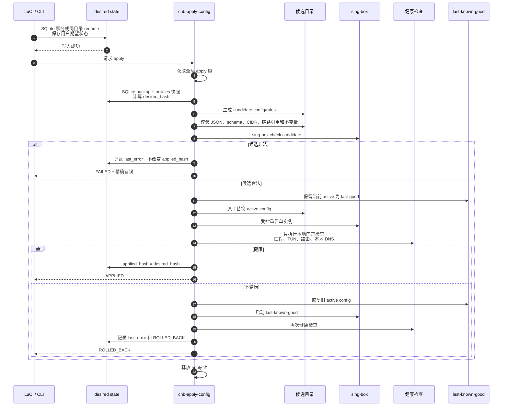

### 10.3 候选不变量

除 `jq`/JSON 语法和 `sing-box check` 外，`chb-apply-config` 还必须验证：

1. 每个启用链路至少有一个有效 hop；
2. 每个业务来源最多绑定一个默认链路；
3. 所有来源 CIDR 互不冲突；
4. 未登记来源的最终动作是 reject，不是 direct；
5. `local-dns.detour == direct`；
6. 不存在缺少生产 inbound、`source_ip_cidr`、专用 DNS 目的地址任一限定的 53 捕获；
7. `wg-mgmt`、总部地址段和 WireGuard endpoint 在 TUN 排除列表；
8. 规则集全部为已存在且校验通过的本地文件；
9. 所有 outbound 引用都存在；
10. 配置生成器不会直接覆盖 active 文件；
11. 数据库 schema 与当前应用版本兼容；
12. 业务 direct 规则必须同时具备业务来源限定和明确策略匹配。

## 11. 配置与运行目录

```text
/data/tiktokproxy/state/
  vps.db                         # 用户期望状态
  policies/                      # 用户策略
  uplink.json                    # WAN 候选档案，0600，含运营商凭据
  lan-profile.json               # mode-a/b/c 的物理/逻辑接入档案

/data/tiktokproxy/runtime/
  active/                        # 当前运行配置
  last-good/                     # 上一个本地健康配置
  state.json                     # desired/applied/last-good hash + last_error
  uplink/active.json             # 当前已应用上联档案
  uplink/last-good.json          # 上一个健康上联档案
  uplink/state.json              # switch_state、hash、错误、窗口
  uplink/uci-last-good/          # network/firewall/dhcp 有界快照
  lan/active.json                # 当前已应用 LAN profile
  lan/last-good.json             # 上一个健康 LAN profile
  lan/state.json                 # desired/applied/error

/data/tiktokproxy/runtime/.apply.<apply_id>/
  vps.db                         # SQLite 一致性快照
  policies/                      # 策略快照
  config.json                    # 候选配置
  validation.log                # 本次临时验证日志
```

`/var/lock/chb-mutation.lock` 只串行化网络 apply、sing-box apply 和应用升级，不引入通用事务服务。用户期望数据分别使用 SQLite 事务或同目录临时文件 rename 原子写入；apply 在持锁后对数据库和 policies 取一致性候选快照。若 apply 期间又发生期望写入，运行配置仍对应本次快照，结束时重新计算的 `desired_hash` 会与 `applied_hash` 不同，LuCI 继续显示“待应用”，不会把旧快照误报为最新状态。

sing-box init 脚本只读取 `runtime/active/config.json`。`generate-config.sh` 必须接受显式输入和输出路径，只能写临时候选目录。候选验证后在 DATA 同一文件系统内用 rename 原子替换配置文件；切换前先把旧 active 原子更新为 last-good，健康失败再恢复。成功或失败后删除 `.apply.<apply_id>`。只保留两份运行配置，避免无限 generation 历史和 DATA 空间增长。

## 12. 健康检查与可观测性

### 12.1 同步发布门禁

门禁分成“修改前置条件”和“修改后因果检查”，不能因为运营商或海外 VPS 抖动而盲目回滚本地配置。

sing-box apply 修改前必须满足：

- 基础 WAN 地址和默认路由已经存在；
- DATA 可读写且数据库 `integrity_check` 通过；
- 路由器本机到国内总部 WireGuard endpoint 的路由指向逻辑 `wan`。

这些前置条件失败时拒绝开始 apply，active 不变；不能先重启 sing-box 再拿旧配置“回滚”运营商故障。

sing-box 切换后只有以下候选直接造成的失败才触发配置回滚：

- sing-box 进程不存在或 PID 无法稳定；
- `singbox-tun` 地址、路由或防火墙捕获缺失；
- 未登记源地址能绕过 TUN 进入 WAN；
- 当前阶段的本地 DNS/FakeIP 自检失败；
- `local-dns.detour`、本地 rule-set 或引用不变量被破坏。

网络档案 apply 使用第 5.4 节的独立 WAN 门禁。普通网络事务可恢复 last-good；外部光猫已改变且新旧档案都无法工作时进入 `RECOVERY_REQUIRED`。

### 12.2 异步运行健康

以下结果用于显示 `healthy/degraded/down`，不因互联网或海外 VPS 临时抖动自动回滚本地配置：

- `wg-mgmt` 最近 handshake；
- 国内 direct 探测；
- 每条启用 VLESS 链路的 TCP/HTTPS 探测；
- CN 测试域名的真实 IP；
- DNS 阶段启用后的代理域名 FakeIP；
- SSH/LuCI 监听面和生产 LAN 隔离状态。

### 12.3 性能预算

新版本必须和同一台硬件、同一条网络、同一组 VPS 的当前版本做 A/B：

| 指标 | 发布门槛 |
|---|---|
| direct、单跳、双跳吞吐 | 任一场景下降不超过 5% |
| 相同吞吐下 CPU | 增幅不超过 10% |
| sing-box RSS | 增幅不超过 15% |
| 配置应用业务中断 | 目标不超过 3 秒，取消固定 sleep |
| DHCP/IPoE 切换恢复 | 同模式参数更新目标不超过 15 秒 |
| PPPoE 切换恢复 | 以运营商拨号完成为准，目标不超过 30 秒 |
| 状态 API 本地响应 | p95 不超过 300 ms，不同步请求公网 |
| 24 小时稳定性 | 无内存持续增长、日志无限增长、路由漂移 |

`auto_redirect` 虽然是 sing-box 在 Linux/OpenWrt 上的推荐能力，但本项目固定 1.11.5 且已经有 firewall4、TUN 和管理排除要求，因此只有在基准证明吞吐或 CPU 优于当前 `auto_route` 且 firewall4 重载兼容时才启用；否则保留当前模式并仅缩小捕获入口。

### 12.4 日志与状态

每次配置应用记录：

```text
apply_id
device_id
desired_hash
previous_applied_hash
candidate_hash
initiator
start_at / finish_at
validation_result
restart_result
health_result
final_state: APPLIED | REJECTED | ROLLED_BACK
error_summary
```

日志有大小和保留期上限，敏感字段如 UUID、私钥和完整节点凭据必须脱敏。

生产 sing-box 日志默认使用 `info`。`debug` 只能通过有时限的诊断开关启用；流量页面不得在每次请求时扫描完整 sing-box 日志，公网出口 IP和链路健康结果必须异步缓存。

## 13. 关键数据流示例

### 13.1 总部 SSH

```text
国内总部运维机
  → 总部 WireGuard 中心
  → 设备 wg-mgmt /32
  → mgmt zone
  → SSH

完全不经过 singbox-tun。
```

### 13.2 GitHub 应用升级

```text
国内总部通过 wg-mgmt 发升级命令
  → 设备固定升级器绑定 WAN
  → 下载精确 GitHub Release
  → 验签、暂存、候选检查
  → 原子切换
  → 结果通过 wg-mgmt 回报

下载与回报均不依赖业务链路。
```

### 13.3 下游路由器业务

```text
下游路由器 A 内部终端
  → NAT 成 192.168.20.11
  → OpenWrt prod zone
  → singbox-tun
  → source 192.168.20.11 命中 chain-A
  → CN 明确规则可 direct；其余默认 chain-A
```

### 13.4 sing-box 崩溃

```text
sing-box 退出
  → 生产流量因无 prod→wan 转发而被阻断
  → procd 按有限次数重启；本次 apply 失败则恢复 last-good
  → wg-mgmt、SSH、LuCI、升级器继续工作
  → 总部仍可诊断或回滚
```

## 14. 验收与故障注入

### 14.1 物理与管理面

- 单 WAN/单 LAN 加非网管交换机时，总部管理不占 LAN VLAN；
- 设备经过上级 NAT 后仍可被总部稳定 SSH；
- 断开 sing-box、删除 TUN、配置无效三种场景下管理隧道都保持；
- 生产 LAN 扫描不到 SSH/LuCI；
- 国内固定 WireGuard endpoint 不可达时有可观察错误，不把流量送入业务链路；
- `wg show` 中只存在国内总部 peer，海外 VPS 地址不出现在 WireGuard 配置；
- 设备 `AllowedIPs` 不包含默认路由，`mgmt` zone 没有 forward；
- 对日本/美国 VPS 执行 `ip route get` 时输出接口是 WAN，不是 `wg-mgmt`；
- 生产流量压测期间 WireGuard 计数器只出现管理心跳和管理操作，不随业务吞吐增长。

### 14.2 双上联与本地恢复

- 光猫路由模式 DHCP：WAN 获得私网地址时仍判定成功，OpenWrt LAN 正常，光猫上其他设备不受影响；
- 光猫路由模式 static：合法地址/网关可应用，错误网关在门禁失败后自动恢复 last-good；
- 光猫桥接 PPPoE：覆盖无 VLAN、有 VLAN、错误密码、错误 VLAN、运营商断线重拨和 CGNAT 地址；
- 光猫桥接 DHCP/IPoE：覆盖无 VLAN、有 VLAN、MAC 克隆、Client ID/Vendor Class 和租约续期；
- `probe` 只检测用户填写的协议/VLAN，不扫描 VLAN、不修改 active；
- 保存候选不改变 UCI；普通激活和 armed cutover 的状态、日志和按钮语义一致；
- armed 期间单次丢包不切换，连续失败才激活候选，30 分钟过期自动清理；
- 光猫仍是路由模式且候选失败时自动恢复 DHCP last-good；
- 光猫已改桥接且 PPPoE 凭据错误时进入 `RECOVERY_REQUIRED`，不谎报“已回滚联网”；
- WAN 断开导致 `wg-mgmt` 消失时，现场电脑可通过逻辑恢复地址查看状态、修正后重试或恢复 last-good；
- 恢复 token 只能使用一次，完整 LuCI/SSH 在恢复地址上不可访问，成功/取消/过期后端口和地址消失；
- 上联从 DHCP 切到 PPPoE 后，WireGuard 只恢复国内总部 peer，海外 VPS 仍不进入 WireGuard；
- 任一上联模式改变都不修改 `vps.db`、policies、链路、子网和应用版本。

### 14.3 三种 LAN 模式

- 模式 A：整个桥接子网使用同一链路，未登记静态 IP不能绕过；
- 模式 B：两个下游 NAT 路由器分别稳定命中不同链路，换 IP/MAC 后 fail-closed；
- 模式 C：VLAN 之间二层/三层隔离，分别命中不同链路；
- 任一模式下日常管理地址只存在于 `wg-mgmt`；只有 ARMED/RECOVERY_REQUIRED 窗口存在限时逻辑恢复地址，且不提供完整管理面。

### 14.4 DNS

- 用 nft trace 证明捕获规则只命中 `prod` 入方向；
- 用 tcpdump 证明查询代理域名 A/AAAA 时 WAN 没有发出该域名的明文 DNS；
- 用抓包证明 CN DNS 只经 direct local-dns；
- 手工指定 8.8.8.8:53 的客户端查询仍进入显式 hijack；
- 路由器自身 NTP、WireGuard、升级 DNS 不命中客户端捕获；
- 删除所有外网 rule-set 可用性后，sing-box 仍使用本地规则集启动；
- FakeIP 映射、QUIC、UDP、非 A/AAAA 查询在目标 sing-box 1.11.5 上逐项验证。

### 14.5 事务和回滚

- 候选 JSON 错误、引用不存在、全局 53、错误 DNS detour 都在重启前被拒绝；
- `sing-box check` 失败时 active 不变；
- 新配置启动后健康失败时恢复 last-known-good；
- LuCI 始终同时显示 desired 与 applied hash；
- apply 过程中断电后，启动脚本只选择完整 active 或 last-good，不读取半成品。
- 网络 apply、sing-box apply 和应用 update 并发时只有一个获得全局 mutation lock；
- `chb-update` 携带匹配 parent operation 时可以调用 sing-box apply，伪造或不匹配 operation 被拒绝；
- WAN 外部抖动在 sing-box apply 前置检查阶段拒绝开始，不触发无意义的业务配置回滚。

### 14.6 IPv6

- `ipv6.mode=off` 时 WAN 不申请 PD、LAN 不发 RA/DHCPv6，生产客户端没有可绕过 TUN 的 IPv6 默认出口；
- `native-pd` 金丝雀同时覆盖 DHCP/IPoE 与 PPPoE，验证前缀续租、WAN flap 和重拨；
- 国外 A/AAAA 不在 WAN 发出明文真实查询，FakeIP IPv4/IPv6 映射都能恢复域名；
- CN IPv6 direct 必须同时命中生产来源和 CN 策略；
- sing-box 停止时 IPv4、IPv6 同时 fail-closed，`wg-mgmt` IPv4 管理仍保持；
- 不满足任一双栈门禁时，全量设备继续保持 `ipv6.mode=off`。

### 14.7 性能

- 保存升级前 direct、单跳、双跳的吞吐、CPU、RSS、DNS p50/p95 和状态 API p95；
- DHCP、PPPoE、VLAN+PPPoE 分别记录 MTU、PMTU、TCP/UDP/QUIC 和直播推流结果；
- 每个阶段在同硬件重复同一测试，超过性能预算立即停止扩散；
- `auto_route` 与 `auto_redirect` 使用相同配置分别预热后测试至少三轮，按中位数决策；
- 打开和关闭 LuCI 状态页时，业务吞吐不应出现可测量下降；
- 生产日志保持 `info` 运行 24 小时，验证日志文件和 flash 写入有界。

## 15. 迁移顺序

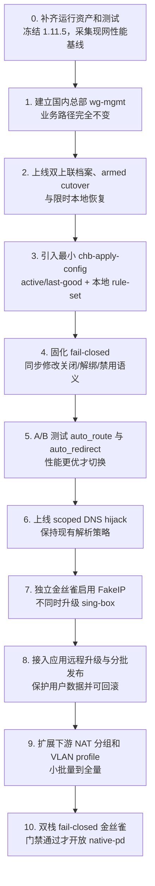

DNS 改造不是第一步。先把管理面和自动回滚建立起来，才有资格修改可能导致业务断联的 DNS/TUN 配置。

每个阶段都必须形成独立可运行版本、独立测试证据和回滚点，禁止把相邻阶段合并成一次全网发布。x86 工厂刷机和 OpenWrt 基础固件 OTA 在 M0-M10 全部开发并完成实机验证后重新评审，不在本计划中并行推进。

## 16. 设计决策摘要

| 问题 | 决策 | 原因 |
|---|---|---|
| 管理口是否使用 LAN VLAN | 否，使用国内总部内核 `wg-mgmt` | 不占物理 LAN，不依赖现场交换机 |
| 海外是否使用 WireGuard | 禁止 | 海外业务始终使用 VLESS，管理隧道不承载业务 |
| 管理策略路由表 | 默认不增加 | 先用 endpoint 主机路由和生产入口白名单，实测不足再加 |
| WAN 上联 | 光猫路由档案与光猫桥接档案 | 覆盖二级路由和主路由，且不混入 LAN/业务策略 |
| 运营商未知 | 显式 DHCP/PPPoE/static + VLAN/MAC/高级字段；只读探测 | 最大化常见兼容性，不进行高风险穷举 |
| 光猫桥接切换 | 先保存、再 arm、外部变更后激活 | 总部失联前把候选和恢复路径预置到设备 |
| 外部模式变更失败 | 进入限时 LAN recovery，不承诺旧 UCI 必然联网 | 光猫已经改变时，单机回滚无法恢复外部状态 |
| 本地管理入口 | 仅切换窗口开放逻辑恢复地址和受限页面 | 不占物理口，也不永久暴露完整 LuCI |
| 一个 LAN 如何扩多组 | 优先多个下游 NAT 路由器；有条件用业务 VLAN | 符合现有硬件现实 |
| sing-box 数量 | 单实例 | 配置、DNS 映射、规则和回滚只有一份 |
| sing-box 失败后是否直连 | 否，业务 fail-closed | 防止代理故障变成泄漏 |
| 客户端 DNS | 分阶段上线专用 TUN DNS + scoped capture + explicit hijack | 避免再次同时修改多个启动依赖 |
| 国外 A/AAAA | 最终使用 FakeIP，独立金丝雀发布 | 先路由后解析，但兼容性必须实测 |
| 国内 DNS | `local-dns` direct | 独立、快速，不制造启动循环 |
| rule-set | 随签名 Release 本地化 | 启动不依赖 CDN |
| 配置写入 | 网络与 sing-box 两个非驻留写入口，共享 mutation lock | 职责解耦，同时禁止并发半配置 |
| 页面状态 | desired/applied/last-good hash 分离 | 防止幽灵数据，不新增 generation 历史表 |
| IPv6 | 默认关闭；完整双栈 fail-closed 金丝雀通过后才开放 | 防止 IPv6 绕过 TUN 或 DNS 策略 |

## 17. 实现复杂度预算与前置门禁

### 17.1 允许新增

- 一个国内总部 WireGuard hub；
- 设备一个内核 `wg-mgmt` 接口和 firewall zone；
- 一个 `/usr/bin/chb-network-profile` 脚本，同时承载明确的 WAN/LAN 子命令和共用 UCI 快照逻辑；
- 一个只在 ARMED/RECOVERY_REQUIRED 窗口运行的网络 guard 和受限恢复 CGI；
- 一个 `/usr/bin/chb-apply-config` 脚本；
- 一个设备端应用升级脚本和一个总部批量触发脚本，均执行完即退出；
- active、last-good、state.json 三份有限运行状态；
- 本地二进制 rule-set；
- 最小 shell/JQ 测试和网络 namespace 故障注入脚本。

### 17.2 明确不新增

- 海外 WireGuard peer；
- 第二个 sing-box；
- 第二个 dnsmasq 或独立 DNS daemon；
- 常驻 apply-manager、配置消息队列或配置中心；
- 永久监听生产 LAN 的 LuCI、SSH 或恢复服务；
- 协议/VLAN/MAC 自动穷举、任意 UCI 文本透传；
- 没有真实线路需求的多 WAN、802.1X、DS-Lite、MAP-E；
- 为三个 LAN 模式新增通用插件框架；
- 无限 generation 历史；
- 在本阶段同时升级 sing-box 大版本；
- x86 工厂刷机与 OpenWrt 基础固件 OTA 实现。

### 17.3 开始编码前必须补齐

当前控制器引用但仓库中缺少 `chb-init-node.sh`、`speedtest-api.sh`、`vps-init.sh`、`chb-update`，同时缺少 settings、traffic、update 页面。这些运行资产必须在对应迁移阶段补齐、替换或删除引用，不能假装已经可发布。

进入全量部署前，所有参与上联、LAN、链路配置、节点初始化、诊断和页面展示的运行文件必须进入 Git 版本追踪；需要建立当前版本和每个迁移阶段的可重复测试。没有运行资产清单、基线数据和自动化测试时，不允许推进到 fail-closed 或 DNS 阶段。

## 18. 参考依据

- 项目事故复盘：`docs/postmortem-2026-07-23-dns-disaster.md`
- 项目调研：`docs/research-dns-architecture.md`
- OpenWrt WAN 协议：[WAN interface protocols](https://openwrt.org/docs/guide-user/network/wan/wan_interface_protocols)
- OpenWrt IPv6：[IPv6 configuration](https://openwrt.org/docs/guide-user/network/ipv6/configuration)
- sing-box v1.11.5 官方源码文档：DNS server、FakeIP、TUN、route rule action、rule-set
- sing-box 当前官方文档：[DNS](https://sing-box.sagernet.org/configuration/dns/)、[TUN](https://sing-box.sagernet.org/configuration/inbound/tun/)、[Rule Action](https://sing-box.sagernet.org/configuration/route/rule_action/)、[Rule Set](https://sing-box.sagernet.org/configuration/rule-set/)
