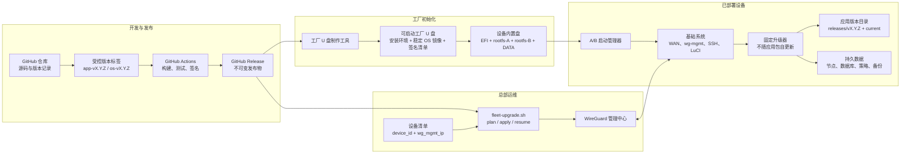
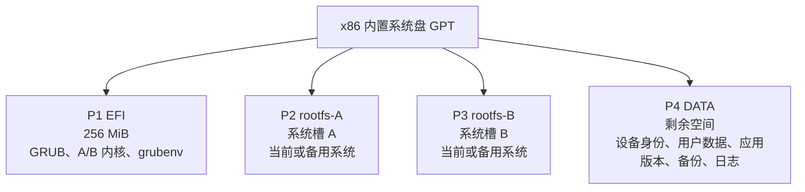
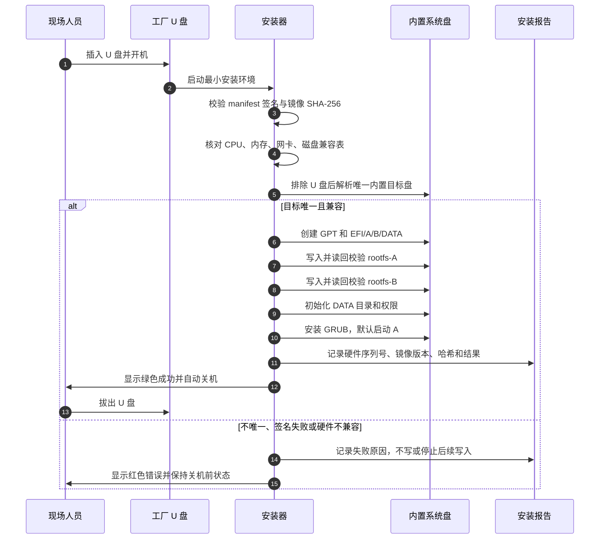
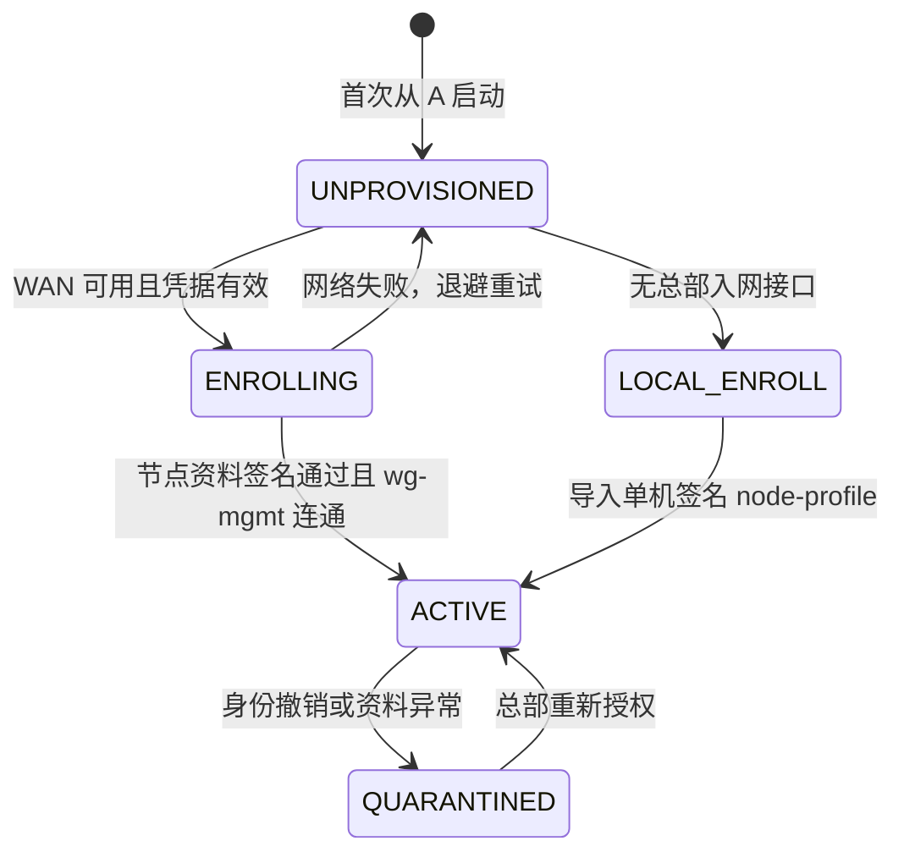
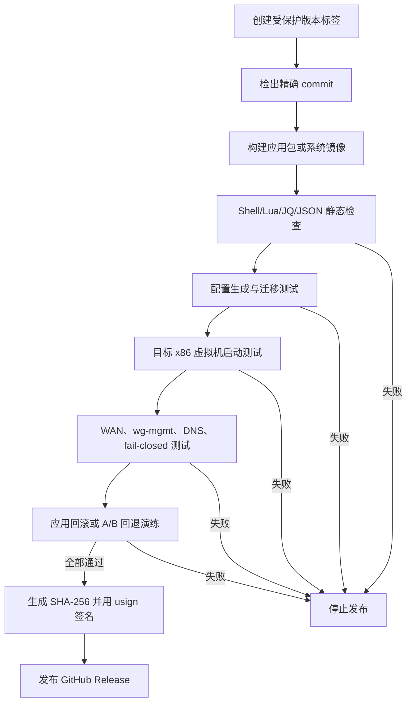
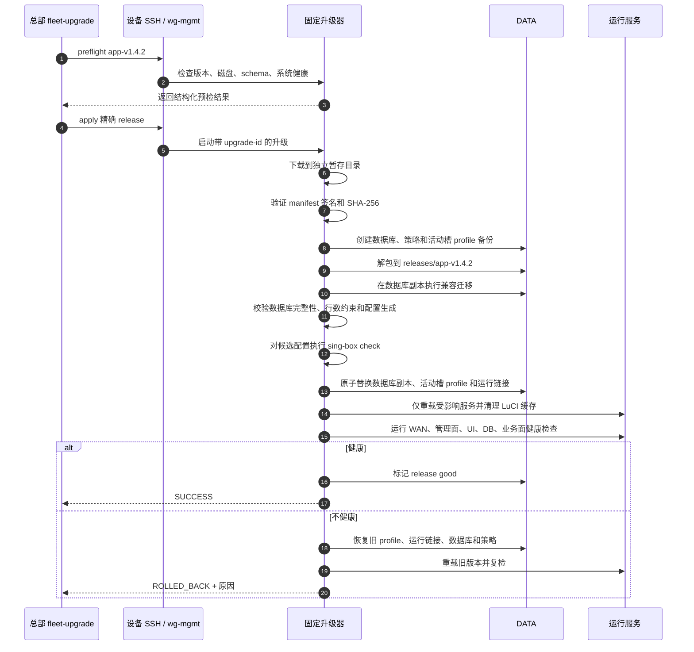
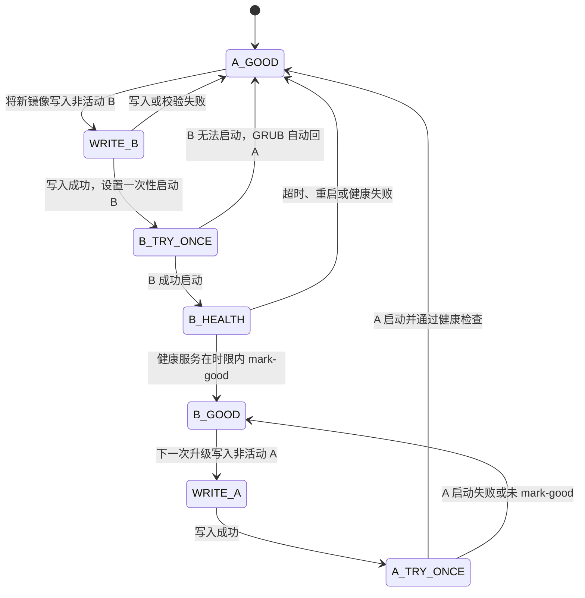
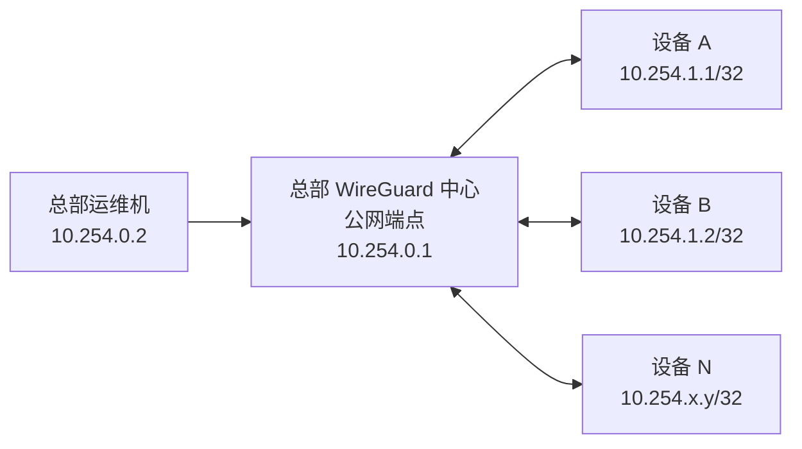
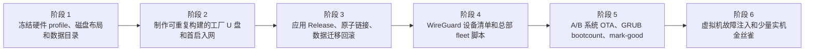

# x86 工厂刷机、零接触入网与可回滚升级设计

> 日期：2026-07-28
>
> 状态：待评审
>
> 适用范围：x86 OpenWrt 跨境播软路由、单 WAN/单 LAN 为主的量产设备
>
> 核心结论：工厂 U 盘负责写入完整可运行系统；应用用原子版本目录升级；系统用 A/B 槽升级；用户数据只放独立数据分区；总部通过 WireGuard 管理网 SSH 分批发布。

## 1. 要解决的问题

当前 `init-subnets.sh` 是面向多物理 LAN 口的实验性拆网脚本，它会动态发现网卡、修改 UCI、写数据库并重载网络，不具备工厂初始化所需的确定性、原子性和失败保护。因此：

- 它不进入首次刷机主流程；
- 它不作为量产设备的开机初始化脚本；
- 新系统直接携带已经验证的基础网络、LuCI、sing-box、升级器和运维组件；
- 首次启动只补充设备唯一信息，不重新“猜测并搭建”整套系统。

目标操作体验是：

```text
拿到新机器
  → 插入工厂 U 盘
  → U 盘自动识别唯一内置系统盘并刷写
  → 校验成功后关机
  → 拔 U 盘并开机
  → WAN 自动联网
  → 设备领取唯一节点信息并建立总部管理隧道
  → 总部可通过固定管理 IP SSH
  → 业务系统可运行
```

## 2. 设计目标与边界

### 2.1 必须满足

1. U 盘包含完整二次开发系统，不依赖现场从 GitHub 临时拼装系统。
2. 除设备唯一信息外，软件、基础网络、服务、规则集和默认配置全部随镜像写入。
3. 刷写过程不能误写 U 盘或其他数据盘；硬件不匹配时必须停止。
4. 部署后总部可用稳定逻辑地址 SSH 到每台设备，即使设备位于 NAT 后。
5. 生产设备不直接 `git pull main`，只安装经过 CI 验证、签名且不可变的发布物。
6. 总部升级脚本必须先展示计划并要求确认，再按预检、金丝雀、分批方式推进。
7. 应用升级失败自动切回旧应用版本。
8. 系统升级失败自动切回旧系统槽。
9. 用户配置、节点信息、策略和数据库与程序包完全分离，开发错误不能借“覆盖程序文件”删除用户数据。
10. 所有升级均记录当前版本、目标版本、结果、失败原因和回滚结果。

### 2.2 明确不承诺

- 完整固件升级一定需要重启，无法做到真正零中断；A/B 的目标是短时、可控且可自动回退。
- 单个 sing-box 进程重启会造成短暂业务连接中断；只改 LuCI 静态文件等应用内容可以做到原子切换。
- 离线设备无法在同一时刻完成升级；“所有机器同步”定义为所有在线设备收敛到同一目标版本，离线设备恢复后补齐。
- 非网管交换机只能增加物理端口，不能增加二层隔离能力；业务网络的三种接法在运行时架构文档中单独说明。

## 3. 总体架构



### 3.1 为什么不是设备直接拉 `main`

`git pull` 适合开发环境，不适合作为量产升级协议：

- `main` 会变化，同一命令在不同时间可能得到不同内容；
- 拉到的是源码，不代表已经通过目标 OpenWrt 版本测试；
- Git 提交不能表达系统镜像、依赖包、数据库兼容范围和硬件兼容范围；
- 一次拉取可能只成功一半，运行目录会进入混合版本；
- 仓库被错误提交时，所有设备会同时暴露在故障中。

因此生产升级单位是“发布物”，GitHub 仓库仍然负责版本追踪，GitHub Release 负责分发经过验证的不可变产物。

## 4. 工厂 U 盘设计

### 4.1 U 盘内容

| 内容 | 用途 | 约束 |
|---|---|---|
| 最小启动环境 | 启动内核、识别磁盘和网卡、执行安装器 | 只做刷机，不承载正式业务 |
| `os-<version>.img.zst` | 已定制 OpenWrt 系统槽镜像 | 必须经过 CI 测试并签名 |
| `manifest.json` | 版本、哈希、硬件兼容、磁盘要求 | 安装前必须解析和校验 |
| `manifest.sig` | 发布签名 | 公钥固化在安装器中 |
| 硬件配置表 | PCI 网卡路径到 WAN/LAN 的确定映射 | 不依赖 eth0/eth1 顺序猜测 |
| 安装与校验程序 | 分区、写盘、读回校验、生成安装报告 | 任一步失败不得标记成功 |
| 可选一次性入网凭据 | 自动领取设备节点信息 | 每批次、短时有效、可撤销 |

不写入工厂 U 盘：

- GitHub 私钥、发布签名私钥；
- 总部 SSH 私钥；
- 所有设备共用的 WireGuard 私钥；
- 生产用户数据库；
- 未经签名的临时开发文件。

### 4.2 内置盘布局

最低建议磁盘容量为 8 GiB；具体系统槽大小由实际包体压力测试后冻结，两个槽必须等大。



| 分区 | 是否随系统升级覆盖 | 是否存用户数据 | 说明 |
|---|---:|---:|---|
| EFI | 仅受控更新 | 否 | 保存启动项、槽状态和内核；普通应用升级不触碰 |
| rootfs-A | 只在 A 为非活动槽时覆盖 | 否 | 完整可启动系统，不与 B 共享系统 overlay |
| rootfs-B | 只在 B 为非活动槽时覆盖 | 否 | 完整可启动系统，不与 A 共享系统 overlay |
| DATA | 否 | 是 | 固件和应用安装器不得格式化或整体覆盖 |

首次刷机把同一已验证稳定镜像写入 A、B 两槽。这样设备从出厂第一天就具备可回退基础，不需要等第一次 OTA 才建立备用槽。

### 4.3 自动选盘规则

安装器按以下顺序判断，不能满足时停止并显示原因：

1. 排除当前启动 U 盘；
2. 排除所有可移动磁盘；
3. 匹配硬件配置表规定的系统盘类型和最小容量；
4. 只允许剩下一个候选内置盘；
5. 写盘前再次核对设备路径、序列号和容量；
6. 若存在两个及以上候选盘，禁止自动写入。

“插 U 盘直接刷机”不等于“遇到不确定情况也盲写”。量产的自动化边界是已认证硬件；超出硬件清单必须人工处理。

### 4.4 刷机流程



### 4.5 首次启动

系统镜像中已经存在：

- 确定的 WAN/LAN 基础配置；
- dnsmasq、firewall4、WireGuard、SSH、LuCI；
- sing-box 二进制和本地规则集；
- 本项目的应用基线版本；
- 固定升级器和健康检查；
- 数据目录结构、默认策略模板和数据库 schema；
- 日志轮转、时间同步和证书根；
- “未入网”与“已入网”两种明确状态。

首次启动只执行以下一次性工作：

1. 挂载 DATA 并验证文件系统；
2. 生成随机 `device_id` 和设备 WireGuard 密钥；
3. 读取不可变硬件序列信息，形成设备指纹；
4. WAN 使用 DHCP 获取基础互联网；
5. 使用一次性凭据向总部入网接口提交 `device_id + 公钥 + 指纹`；
6. 领取唯一的 `wg_mgmt_ip/32`、总部 peer 和签名后的 `node-profile.json`；
7. 建立 `wg-mgmt`，总部登记 peer；
8. 通过管理隧道报告首次启动健康状态；
9. 原子地把设备状态从 `UNPROVISIONED` 改为 `ACTIVE`。



零接触入网需要一个很小的总部入网接口，这是自动分配唯一管理地址和 WireGuard peer 的必要条件。若暂时不建设该接口，降级方案是在 U 盘的加密分区放置“每台设备唯一、已签名”的 `node-profile.json`，但不能把同一个设备私钥复制到整批机器。

## 5. 设备目录与数据所有权

程序、生成物和用户数据必须分开：

```text
/rom 或系统槽
  /usr/sbin/tiktok-updater           # 固定升级器，应用包不能覆盖
  /usr/lib/tiktok-bootstrap/         # 启动和健康检查
  /usr/lib/tiktok-runtime-links/     # 运行路径的固定入口

/data/tiktokproxy
  /identity/                         # device_id、WireGuard 私钥、签名节点资料
  /state/                            # vps.db、策略、用户配置
  /releases/app-vX.Y.Z/              # 只读应用版本目录
  /boot-profiles/A.json              # A 槽应使用的应用版本和兼容范围
  /boot-profiles/B.json              # B 槽应使用的应用版本和兼容范围
  /backups/<upgrade-id>/             # 升级前数据与元信息备份
  /upgrade/                           # 下载暂存、锁、运行记录
  /logs/                              # 有界日志

/run/tiktokproxy
  /current -> /data/tiktokproxy/releases/app-vX.Y.Z
                                      # 本次启动按活动槽 profile 生成的运行链接
```

固定运行路径不再由升级脚本逐文件覆盖，而是指向本次启动生成的 `/run/tiktokproxy/current`：

```text
/usr/bin/vps-db.sh
  -> /usr/lib/tiktok-runtime-links/vps-db.sh
  -> /run/tiktokproxy/current/openwrt/scripts/vps-db.sh
```

LuCI controller、view 和 sing-box 配置生成器采用同样的固定入口。切换一个 `current` 符号链接即可改变整套应用版本，避免 controller 已更新但 view 或脚本仍是旧版本的混合状态。

A/B 两个系统槽分别保存自己最后验证过的应用版本引用。应用 OTA 只更新当前活动槽的 boot profile；系统回退到另一个槽时，bootstrap 根据该槽 profile 自动选择与旧系统兼容的应用，而不是继续运行新系统留下的共享 `current`。任何仍被 A 或 B 引用的应用版本都禁止被清理。

### 5.1 数据保护红线

1. 应用发布包禁止包含 `/data/tiktokproxy/state`、`identity` 和 `backups`。
2. 升级器禁止执行对 DATA 根目录的递归删除。
3. 所有迁移先作用在数据库副本，验证后再原子替换。
4. 发布清单必须声明可读 schema 范围，超出范围直接拒绝安装。
5. 自动迁移只允许向后兼容的 expand 阶段：新增表、列、索引或默认值。
6. 删除列、删除表、重解释旧字段属于 contract 阶段，必须跨至少一个稳定版本后单独维护执行，不能和功能发布绑定。
7. 迁移失败时同时回退应用链接、数据库和策略快照。
8. 升级完成后的备份按容量上限和版本数有界保留；删除备份前先保证至少有一个已验证可恢复点。

## 6. 发布物设计

### 6.1 两类发布

| 类型 | 标签示例 | 内容 | 是否重启机器 |
|---|---|---|---:|
| 应用 OTA | `app-v1.4.2` | LuCI、脚本、模板、本地规则集、兼容迁移 | 通常否 |
| 系统 OTA | `os-v2.1.0` | 内核、OpenWrt rootfs、基础包、固定升级器 | 是 |

更新固定升级器、WireGuard 基础组件、分区或启动逻辑只能通过系统 OTA，应用包不得自我替换升级器。

### 6.2 CI 发布闸门



发布签名使用 OpenWrt 友好的 `usign`：

- 私钥只保存在受保护的 GitHub Actions secret 或离线签名环境；
- 公钥固化在工厂安装器和系统槽；
- 设备先验签清单，再校验产物哈希；
- GitHub HTTPS 只是传输层，签名才是设备接受发布物的信任依据。

### 6.3 最小发布清单

以下是字段语义，不是最终文件格式承诺：

```json
{
  "release": "app-v1.4.2",
  "type": "app",
  "commit": "完整 Git commit SHA",
  "created_at": "RFC3339 时间",
  "hardware_profiles": ["x86-profile-a"],
  "min_os_version": "os-v2.0.0",
  "schema_read": {"min": 3, "max": 5},
  "schema_write": 5,
  "artifacts": [
    {"name": "app-v1.4.2.tar.zst", "sha256": "十六进制哈希"}
  ]
}
```

设备只接受精确 release tag，不接受“当前 main”“最新 commit”或未签名 URL。

## 7. 应用 OTA

### 7.1 总部发起

总部脚本至少提供：

```text
fleet-upgrade.sh plan  app-v1.4.2
fleet-upgrade.sh apply app-v1.4.2
fleet-upgrade.sh resume <upgrade-run-id>
fleet-upgrade.sh status <upgrade-run-id>
```

`plan` 是纯只读操作，输出：

- 发布标签、Git commit、CI 结果和签名状态；
- 每台设备当前应用/系统/schema 版本；
- 兼容、不兼容、离线、磁盘不足和身份异常列表；
- 默认发布波次和预计需重启的服务；
- 金丝雀设备。

`apply` 要求操作者输入完整目标标签确认，不能用模糊的 `yes`。默认波次：

1. 所有设备只做预检；
2. 1 台金丝雀；
3. 观察健康窗口；
4. 小批量；
5. 剩余在线设备分批；
6. 离线设备进入待补齐列表。

### 7.2 设备原子切换



### 7.3 无感范围

| 更新内容 | 切换方式 | 用户感知 |
|---|---|---|
| LuCI 页面、只读脚本 | 切换链接并清 LuCI 缓存 | 通常无业务流量中断 |
| 数据库兼容迁移 | 短锁 + 原子替换 | 页面写操作短暂不可用 |
| sing-box 生成逻辑或运行配置 | 候选校验后重启单实例 | 现有代理连接可能短暂中断 |
| 内核、驱动、基础网络包 | A/B 系统升级并重启 | 有一次可控重启窗口 |

不能把所有更新都宣传成“绝对无感”。设计保证的是：不出现半升级状态、故障自动回滚、业务中断有界且管理通道不随 sing-box 一起丢失。

## 8. A/B 系统 OTA

### 8.1 状态模型



### 8.2 系统升级步骤

1. 确认当前活动槽和已知良好槽；
2. 校验目标系统版本与硬件 profile；
3. 验证 DATA 文件系统和数据库备份；
4. 检查当前应用和目标应用都与新旧两个系统槽兼容，并为非活动槽写入明确的 boot profile；
5. 下载、验签并写入非活动 rootfs；
6. 将新内核写成 EFI 中独立的非活动槽文件，`fsync` 并读回校验；不覆盖当前槽内核和固定 GRUB 配置；
7. 对非活动槽执行读回哈希校验；
8. 最后才写入一次性启动项，不修改永久默认良好槽；
9. 在维护窗口重启；
10. 新槽启动后只读检查 DATA，再挂载，并按该槽 boot profile 建立运行链接；
11. 检查 WAN、时间同步、WireGuard 管理隧道、SSH、LuCI、数据库完整性、候选配置生成；
12. 若设备已经配置业务，再检查 sing-box 进程和 TUN；
13. 所有必需检查通过后才 `mark-good`；
14. 未在时限内 `mark-good`、连续启动失败或 watchdog 重启时，GRUB 自动回原槽；旧槽 bootstrap 自动选择旧槽 profile 中的应用版本。

系统升级永远只写非活动槽和必要的启动状态，不写活动槽，不格式化 DATA。

固定 GRUB 配置和 bootloader 不进入普通自动 OTA，避免共享 EFI 启动链成为 A/B 之外的单点故障。若未来必须升级 bootloader，应作为独立维护操作并先验证可从救援 U 盘恢复。

### 8.3 系统与数据 schema 兼容

每个系统版本声明可读取的 schema 区间。允许自动升级的前提是：

- 新系统能读当前 schema；
- 当前良好旧系统也能读迁移后的 schema；
- A、B 两个 boot profile 引用的应用都仍存在且能运行在对应系统槽；
- 迁移是 expand-only；
- 数据备份已完成并通过恢复演练规则。

如果新功能必须进行不可逆 schema 变更，该版本不能自动批量推送，必须拆成“先发布兼容读写代码—观察—再单独收缩旧字段”的多个发布阶段。

## 9. 总部 SSH 与批量升级

总部通过独立 `wg-mgmt` 管理网访问设备：



每台设备主动建立出站 WireGuard 会话，因此现场即使没有公网 IP、经过运营商 NAT，总部仍可使用稳定地址：

```text
ssh root@10.254.1.23
```

“直接访问”指无需现场端口映射或临时反向 SSH；实际数据经过总部 WireGuard 中心转发。设备防火墙只允许总部管理网访问 SSH/LuCI，不向普通 WAN 和业务 LAN 暴露。

### 9.1 升级并发原则

总部脚本并发 SSH，但不让全网设备同秒重启：

- 先全量并行预检；
- 每波限制设备数量和同站点数量；
- 一台设备失败不阻断已完成设备，但阻止下一波自动扩散；
- 达到失败率阈值立即停波；
- 每台设备升级有独立 `upgrade-id`，重复执行是幂等恢复，不重复破坏数据；
- 总部保留成功、回滚、离线、待人工四类结果。

## 10. 故障与回退矩阵

| 故障 | 设备行为 | 总部看到的结果 |
|---|---|---|
| GitHub 不可达 | 不改变当前版本 | `DOWNLOAD_FAILED`，可重试 |
| 清单签名错误 | 拒绝安装并告警 | `SIGNATURE_REJECTED` |
| 磁盘空间不足 | 预检失败，不下载 | `NO_SPACE` |
| 应用解包中断 | 暂存目录无效，`current` 不变 | `STAGE_FAILED` |
| 数据迁移失败 | 删除候选副本，原数据库不动 | `MIGRATION_FAILED` |
| 新应用健康失败 | 恢复旧链接和数据快照 | `ROLLED_BACK` |
| 系统写非活动槽失败 | 保持当前槽启动 | `SLOT_WRITE_FAILED` |
| 新系统无法启动 | GRUB 自动回旧槽 | `BOOT_ROLLBACK` |
| 新系统启动但管理网失败 | 不 mark-good，自动回旧槽 | `HEALTH_ROLLBACK` |
| sing-box 配置错误 | 候选 `check` 拒绝应用 | `CONFIG_REJECTED` |
| 设备离线 | 不改变设备 | `OFFLINE_PENDING` |
| 总部脚本中断 | 设备继续完成当前原子事务；总部可 resume | `RUN_INCOMPLETE` |

## 11. 安全设计

1. SSH 只允许密钥登录，禁用密码和 WAN 公网监听。
2. WireGuard 每台设备独立密钥；撤销单台不影响其他设备。
3. 发布物使用独立发布签名密钥，不能复用 SSH 或 WireGuard 密钥。
4. 一次性入网凭据有批次范围、有效期和使用次数限制。
5. 工厂安装报告不记录私钥，只记录公钥指纹和哈希。
6. 升级命令携带精确 release 和唯一 upgrade-id，防止重放成未知版本。
7. 应用包解包时拒绝绝对路径、`..` 路径穿越和越过版本目录的符号链接。
8. 下载、验签和解包使用独立暂存目录；失败时不接触当前运行目录。
9. break-glass 救援默认只允许本地控制台或救援 U 盘，不常驻开放 LAN 管理入口。

## 12. 验收标准

### 12.1 工厂刷机

- 在认证硬件上从插 U 盘到关机无需人工输入；
- 安装器不会选择 U 盘作为目标盘；
- 多候选磁盘时停止而不是猜测；
- 拔 U 盘后 A、B 两槽都能独立启动；
- DATA 在 A/B 切换后保持一致；
- 未入网设备不会暴露 WAN SSH。

### 12.2 入网与管理

- WAN 位于 NAT 后时设备仍能主动建立 `wg-mgmt`；
- 总部可通过唯一 `/32` 地址 SSH；
- 停止 sing-box 不影响 `wg-mgmt`、SSH、LuCI 和升级器；
- 普通业务 LAN 不能访问 SSH/LuCI；
- 撤销设备 peer 后总部与设备双方都拒绝旧身份。

### 12.3 应用升级

- 应用包损坏、签名错误、迁移错误和健康失败四种场景均不会改变用户数据；
- `current` 切换前后不存在混合版本文件；
- 回滚后数据库、策略、LuCI 和脚本版本一致；
- 同一 upgrade-id 重试不会重复执行破坏性操作；
- 至少完成一次从新版本自动回退到旧版本的演练。

### 12.4 系统升级

- 只写非活动槽；
- 模拟新槽内核无法启动时自动回旧槽；
- 模拟 WAN、管理隧道和数据库健康失败时不 mark-good；
- 模拟升级中断电后仍至少有一个可启动良好槽；
- 系统回滚后 DATA 不丢失且旧系统仍能读取 schema。

## 13. 分阶段落地



实现顺序不能从“批量推送”开始。先证明单机具备数据隔离和自动回滚，再开放总部批量发布；否则只是把单机错误更快地扩散到全网。

## 14. 设计决策摘要

| 决策 | 采用方案 | 原因 |
|---|---|---|
| 首次初始化 | 可启动工厂 U 盘写完整镜像 | 可重复、离线可用、不会依赖运行时脚本拼装 |
| 设备唯一信息 | 首启生成密钥并领取签名节点资料 | 避免整批设备共享身份 |
| 应用发布 | GitHub Release + 签名 tar 包 | 精确、不可变、可审计 |
| 应用切换 | 版本目录 + 原子 `current` 链接 | 避免逐文件覆盖产生混合版本 |
| 系统发布 | A/B 槽 + 一次性启动 + mark-good | 内核或基础网络故障仍可自动恢复 |
| 用户数据 | 独立 DATA 分区 | 固件与应用覆盖均不触碰用户数据 |
| 总部访问 | WireGuard 逻辑管理网 | 不占 LAN 口、不需要现场公网 IP |
| 批量升级 | SSH 预检、确认、金丝雀、分批、可恢复 | 限制错误发布的爆炸半径 |
| `init-subnets.sh` | 不用于量产初始化 | 当前模型与单 WAN/单 LAN 硬件及原子性要求不匹配 |
